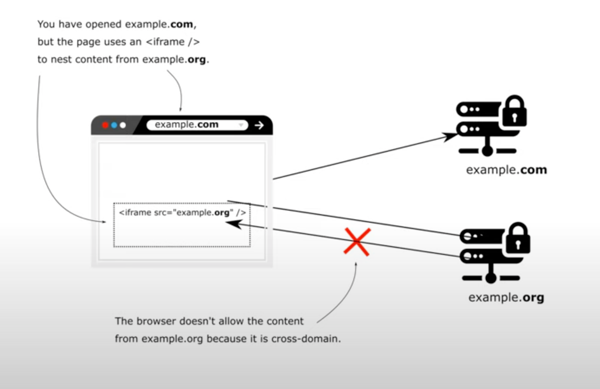
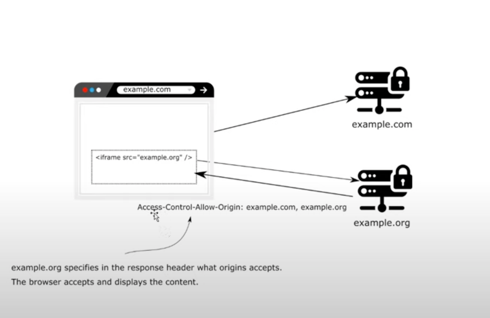
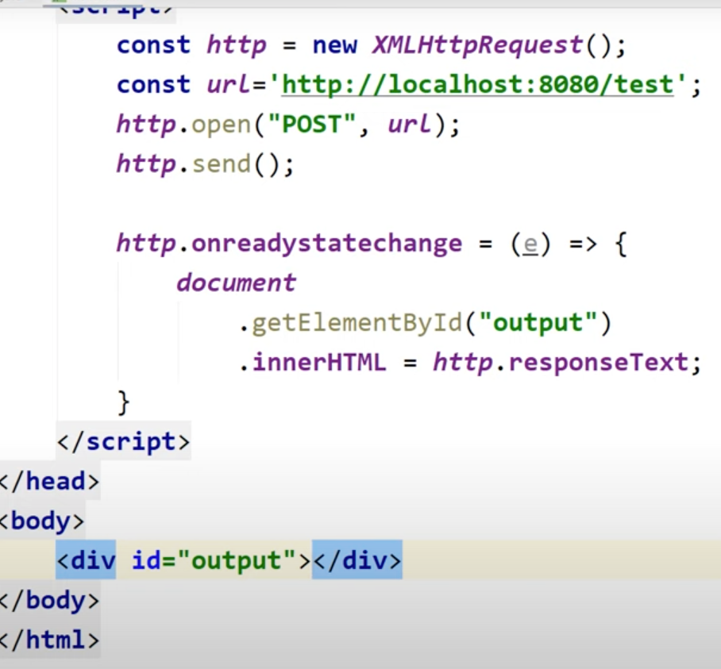
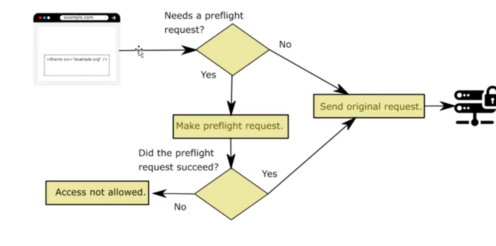

# Chapter 10

#### CORS (Cross Origin Resource Sharing)

- Application can have multiple origins being used in a web app
- One can be serving images, other can be a web server 
- One origin is the main other one throw cors error when accessed via web browser
- NOTE:
    - Angular ng serve runs a server on 4200
    - Spring security on runs some other port say 8080
    - Two different ports mean two different origins
    - @CrossOrigin is static way of allowing other otigins which is the worse way
- Anything not running on same host:port is other origin
- Protects client

 

## Demo

### Create a new project with required dependencies
- spring web, spring security, thymeleaf

### See how the CORS restrictions work
- Create Spring MVC controller that returns view
    - controller package
    - Create MainController
    - "/"
        - Create web page with @Controller
        - Create @GetMapping("/") main returning main.html // Spring MVC -> Spring will lookg to find main.html
    - "/test"
        - Create @PostMapping("/test) test // spring knows and does not have to look for a page
        - Add @ResponseBody as it is behaving like a rest endpoint (Ideally such endpoints should be in a different controller) 
        - return String "Test!"
- create html file
    - in resources/templates create main.html
    - Add JavaScript code to call test endpoint
    - result will be stored in div id="output"
    - 
- Create Spring security beans
    - Package config
    - ProjectConfig @Configuration
    - extend WebSecurityConfigurerAdapter
    - override configure(HttpSecurity http)
        - Remove super call
        - http.csrf(),disable() // Lesson 9
        - Disable authorization
            - http.authorizeRequests(),anyRequests().permitAll()
- Test the application
    - Do localhost:8080 which internally calls localhost:8080/test which is the same origin and hence you view "TEST!"
    - Doing 127.0.0.1:8080 throws CORS
        - NOTE: Difference between MVC and Rest Controller
            - Rest Controller = @Controller + @ResponseBody
        - localhost and 127.0.0.1 are treated as 2 separate hosts for the browseras it compares hosts as String
        - Acces-Control-Allow-Origin mentioning allowed origins is absent in the response
    - <b><CORS Issue With mutating operations</b>
        - MainController: add sout(":(")) to see if controller is called: It is called even though cors is raised
            - This is a concern as post will not stop any operation (say mutable). It just does not send the result to the UI
        - 
            - Preflight request is a test request done by the browser
            - We do not have a pre flight request, hence the method was called

## Solving CORS issue using @CrossOrigin  
- MainController
    - On test @CrossOrigin("*") // all origins http://example.com (Not ideal in real world)
        - * for default is mandatory in newer spring versions
- Test the app
    - Doing 127.0.0.1:8080 outputs "TEST!"
    - You can view the Access-Control-Allow-Origin: * in response header for test endpoint
- @CrossOrigin("*")
    - Can be added to endpoint or class
    - In real world we have multiple environments where we have to configure different hosts
    - Hence, comment it out
    
## Solving CORS issue using CORS Filter from filter chain
- In configure(http) in Project Config
- Ideally add configurations in separate classes
- Do http.cors( c -> { 
    CorsConfigurationSource cs = r -> {
        // allows to configure cors per request
        CorsConfiguration cc = new CorsConfiguration()
        // mandatory to set both origins and methods (REST methods)
        cc.setAllowedOrigins(List.of("*")) 
        cc.setAllowedMethods("List.of("GET","POST")
        // in real world these values can be picked from properties file
    }
  c.configurationSource(cs);
} )
- Test the application
    - Doing 127.0.1:8080 works with Access-Control-Allow-Origin: *
    