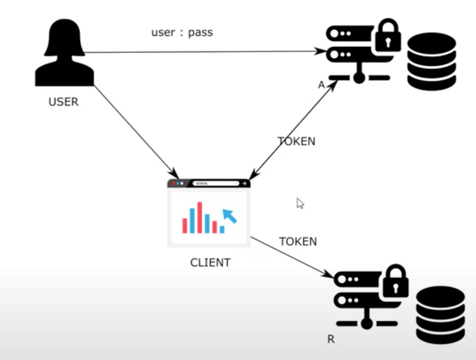

# Chapter 10

#### OAuth2: Create a custom authorization server

- 4 actors
    - User
        - Using the application
    - Client
        - Can be ng/react on browser or a mobile/tablet application
        - Client should get token from authorization server in order to call resource server
    - Resource Server
        - Backend of the client
    - Authorization Server - Separate server to manage users
- It is all about to get a token to be authenticated
- Analogy: Go to reception of a building to get id card
    - Reception(a server) gives access card
    - Client can access some doors(endpoints) in floor with room (resource server)

## Demo

### Create new project with required dependencies

- spring web, spring security, cloud-oauth2

### UserManagementConfig

- create class in config package as @Configuration
- Responsibility: Know the user
- Credentials for users
    - Create bean for UserDetailsService
        - Create uds = new InMemoryUserDetailsManager()
        - Create user u = User.withUsername("john").password("12345").authorities("read").build()
        - Do uds.createUser(u)
        - return uds
    - Create bean for PasswordEncoder doing a NoOp

### AuthServerConfig

- create class in congfig package with @Configuration
- Do @EnableAuthorizationServer annotation to enable authorization server
- Responsibility: Know the client
- Credentials for clients
    - extend AuthorizationServerConfigurerAdapter
    - Override configure(clients) and configure(endpoints)
    - configure(clients)
        - Helps configure clients
        - clients with credentials should be able to access endpoints
        - clients.withClientDetails => Define our own clientDetailsService (Like JpaUserDetailsService for user
          management)
        - We do clients.inMemory().withClient("client1").secret("secret1").scopes("read") (Similar to
          usernmae,pass,authorities)
        - <b>Grant type</b>
            - How the client obtains the tokens
                - Using grant types
        - Add comments abode code
            - Grant types:
            - authorization_code / pkce
            - password ---> deprecated
            - client_credentials
            - refresh token
            - implicit ---> deprecated
        - Add to the builder .authorizedGrantTypes("password")
    - configure(endpoints)
        - plug user management to authorization server</b>
    - <b>link users to authorization server</b>
        - In UserManagementConfig extend WebSecurityAdapterConfigurer
            - Override authentication manager and make it a bean
        - In AuthServerConfig
            - configure(endpoints)
            - Autowire authenticationManager and do endpoints.authenticationManager(authenticationManager)
- Test authz server with password grant type
    - Try to obtain a token
    - On startup we see endpoints:
        - /oauth/token->obtain token
        - /oauth/token_key->asym keys,
        - /oaut/check_token-> used by resource manager to validate token
    - <b>Password grant type</b>
        - User provides credentials to authz server
        - authz server returns token to the client to user
        - Not recommended if you do not trust tthe client for it's security
    - For client to call the token, add basic auth client1, secret1 as clientId/secret
    - do a post http://localhost:8080/oauth/token?grant_type=password&username=john&password=12345&scope=read
    - response
        - access_token
            - it is an OPAC token
            - they act like password and do not have any information about the user/client/expiry time
            - oauth2 does not enforce use of any token. Allows you to create your own tokens
        - token type: bearer. Anybody having this value can use the resource it was meant for
        - expires_in
        - scope: read

### Authorization code grant type

- User does not share credentials with the client
- Client redirects user to authorization server where the user can directly authenticate by a page exposed by
  authorization server
- Hence, this is a more secure way as we remove client actor knowing any credentials
- User calls client to see something -> Client redirects user to authz server -> Authz sends token to client
- On AuthServverCondig
    - in configure (clients)
    - do and() and repeat client code with authorizedGrantTypes("authorization_code), client: client2, secret: secret2
    - How does the server call back the client? Using redirect url
        - redirectUris("http://localhost:9090") // will throw error as the client does not exist
    - How does user interact with authorization server to authenticate
        - Spring does this with form login
        - UserManagementConfig
            - override configure(http)
            - http.formLogin()
            - http.authorizeRequests().anyRequest().authenticated()
- Test the application
    - Go to browser
    - localhost:8080/oauth/authorize?response_type=code(auth code/implicit->token)&client_id=client2&scope=read -> user
      communicates with client and client redirects user to auth server(formLogin)
    - Redirected to login
    - try credentials: john|12345
        - You are asked to approve or deny scope.read
    - error as uri localhost:9090 dies not exist
    - Still, url has the access code as "code"
    - Use code via postman
    - http://localhost:8080/oauth/token?grant_type=authorization_code&scope=read&code=ey332p
        - Use basic auth username client2 and secret: secret2
    - Response is same as password grant type
    - Code works single time. Running it again would not work (We can do user refresh tokens)