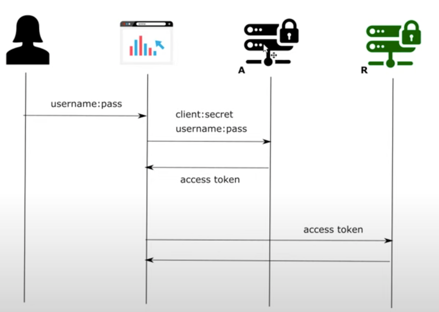
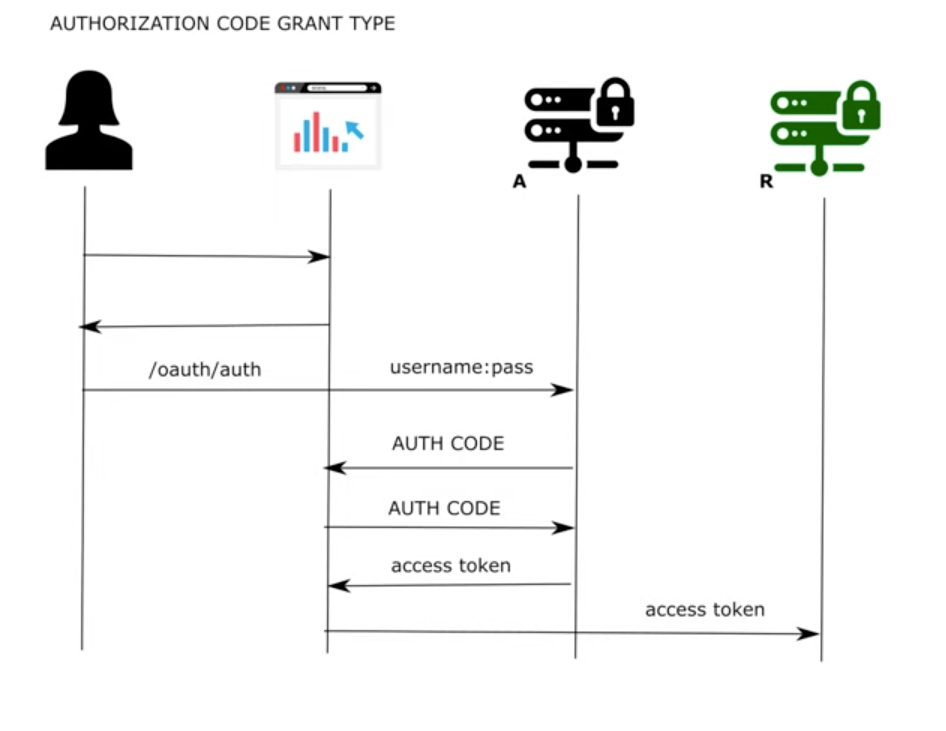
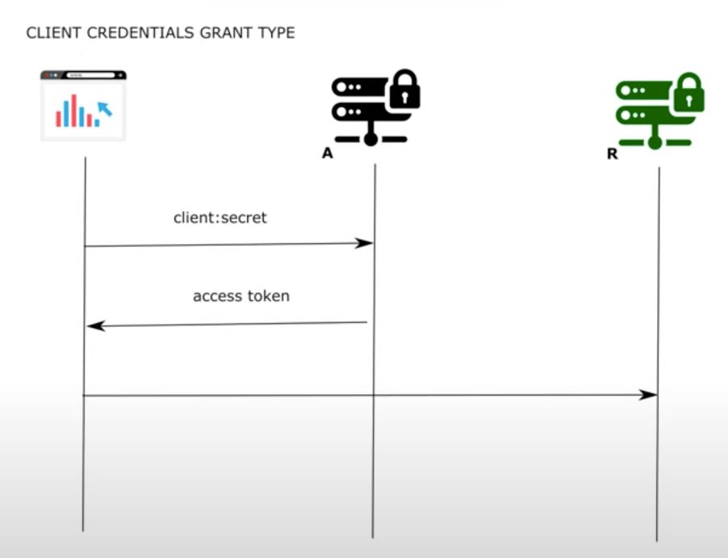
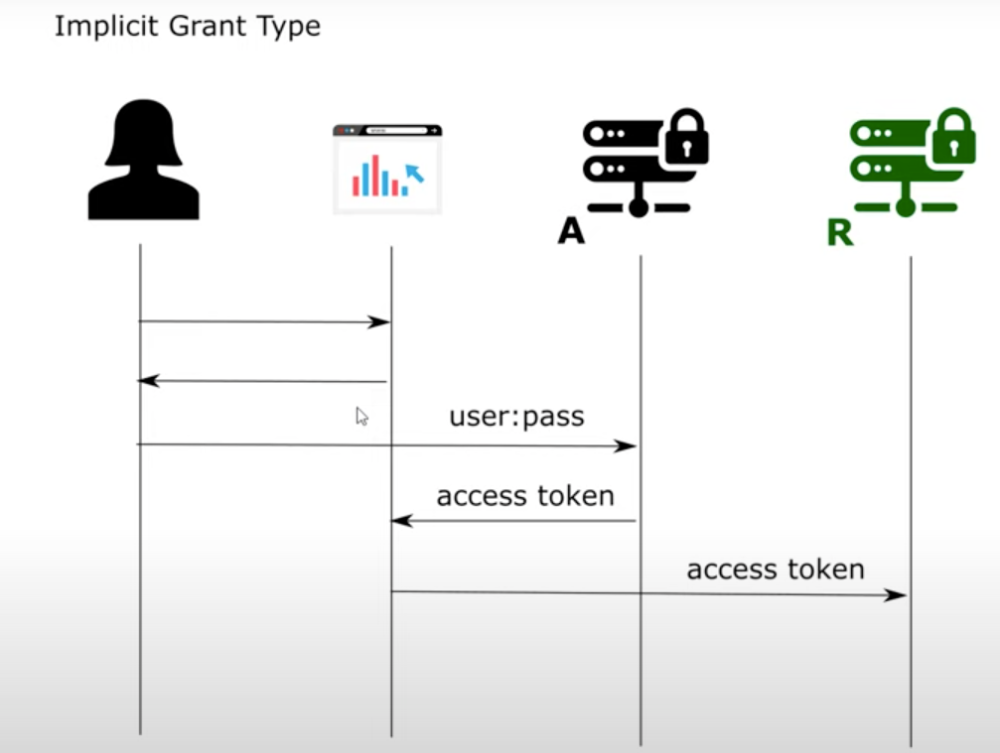
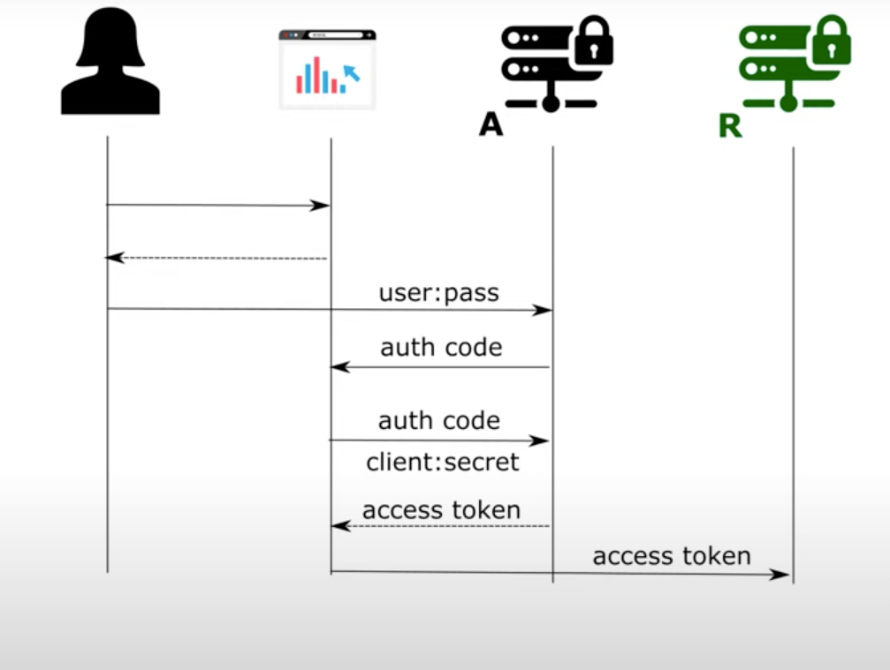

# Chapter 12

#### Deeply understanding the grant types

- Oauth2: Client gets token from auth server to access resource server on behalf of the user
- Resource server is the backend
- Auth server: Provides access token to client to access the resource server
- Client: Postman/Chrome

## Password grant type

- Client knows users username+password
- Client sends username+password to authorization server
- Authorization server provides client  valid token
- Client sends token to the resource sever
- Resource server will validate the access token and perform the client request

### Demo
- NOTE: OpenId Connect is a protocol above OAuth2 to enforce some more specification and restrictions over scopes and endpoints
 
#### Test password grant type for client1 via postman client
- Run the application
- Go to postman (client)
- localhost:8080/oauth/token?grant_type=password&username=john&password=12345&scope=read
- Client credentials
    - Basic Auth client1:secret1
- access token is a plain UUID => OPAQUE

## Authorization code grant type

- User tries to access resource server via client
- User does not send any credentials
- Client ask user to provide credentials to auth server for getting the token by redirecting them to authorization server
- Better than password grant type as client does not know the username and password
- Client sends username+password to authorization server 
- Authroization server provider authorization code to client
    - If token was returned then it would have been implicit grant type (deprecated)
    - THis was a vulnerability as there could have been a redirect
- Client sends auth code to authorization server
- Authorization sends access token to the client
- Client sends access token to the resource server
- Username password is known only by the people who know the username and password => User and Authorization server

### Demo

#### Test authorization grant type for client2 via browser client
- Restart auth server application
- Call /oauth/authorize
    - localhost:8080/oauth/authorize?response_type=code&client_id=client2&scope=read
    - Client providing it's information to the authorization server to redirect suer to login page
- Login credentials for the user
    - john | 12345
    - Sign in and approve authorize
    - Redirected to the client to get the auth code
    - Redirect url should be part of the client application
- Do a post via postman
    - localhost:8080/oauth/token?grant_type=authorization_code&scope=read&code=CBkmqr
    - Add basic auth for client2
        - client2 | secret2
    - Authorization code works only once
- Safe as works only for registered clients and needs auth code via client

## Client Credentials grant type

- User actor is not present in this grant type
- Use case:
    - Endpoint to make sure that the application is up and running/ or telling some details about the application for general consumption
    - E.g CLient can be kubernetes to check liveness of the application
- Client sends client:secret to authorization server
- Authorization server sends back the access token to the client
- Client Sends access token to the resource server

### Demo

#### Add a client in AuthServerConfig
- Copy client 1 and do
    - client3: secret3 and client_credentials(grant type)

#### Test the application with postman client
- do localhost:8080/oauth/token?grant_type=client_credentials&scope=read POST
- Basic auth client3|secret3
- You get back the OPAQUE access token

## Refresh token grant type
- Makes sense to use with another grant type

### Demo

#### Add refresh token grant type
- Add it for client1 and client2 in AuthServerConfig

#### Test the refresh token (via client1 postman)
- Hit the password grant type post
- Response changes with an additional refresh token
- <b>Refresh token</b>
    - Same OPAQUE as access token
    - We use this value to obtain a new access token without needing the user to authenticate again
    - Use case: Avoid need for user to authenticate again
    - Use it to get new access token
        - Do localhost:8080/oauth/token?grant_type=refresh_token&refresh_token=<refresh token> POST request
        - Add Basic auth client1|secret1
    - Throws NPE
        - To Fix it, add user details service bean in configure(endpoints) // seems like a bug with spring security that you have to add the bean in configure explicitly

## Quick demo on changing tokens by changing token store
- OAuth 2 does not enforce usage of any specific type of token
- You use token store from spring
    - In AuthServerConfig
        - Create JwtAccessTokenConverter methods returning the object
        - Create Bean Token Store
            - var tokenStore = JwtTokenStore jwetAccessTokenConvertor by calling convertor
            - return tokenStore
        - Add tokenStore(tokenStore()).accessTokenConvertor(convertor()) in endpoints configure after manager
- Test the application
    - Do password grant type
    - You can view the jwt token in access and refresh token
- We have different implementations of token store
    - We use in memory and jwt token store
    - We can also store tokens in database using Jdbc
    - Jwt used for storing certificates

## Implicit Grant Type vs Authorization code grant type

- Difference of both with password grant type
    - User and auth server know user name and password
- Authorization Server returns authorization code vs token in case of authorization code grant type
- Authorization code is sent to authorization server to get the access token
- Why does getting authorization code benefit in terms of security?
    - In implicit, access token is returned without authenticating the client
    - it is a bearer token: i.e whoever has it can access the resource server
    - Thus, AC grant type, authorization code is sent to the client first
    - While making call to authorization server again with auth code, client need client:secret too. Thus the authorization server authenticates the client as well
    - Return of auth code is actually a request which is easier to fake
- Implicit grant type is deprecated
- Authorization code grant type adds additional step for client authentication