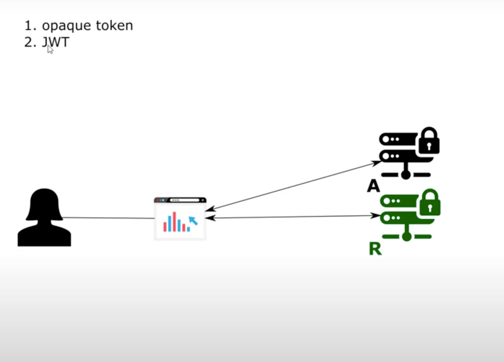

# Chapter 13

- Validating opaque tokens on resource server

# OPAQUE token
- OPAQUE token is just a string with no information
- It can be authenticated by resource server in 3 different ways to validate this token

## Opaque token scenario 1: Introspection token endpoint
-
- Resource server making call to the authorization server to get details about OPAQUE token

### Demo

#### Create a new project with dependencies
- spring web, spring security, oauth2

#### Configurations
- Create package called config
- UserManagemenetConfig
    - @Configuration
    - PasswordEncoder
        - @Bean
        - new BCryptPasswordEncoder()
    - UserDetailsService bean
        - @Bean
        - new InMemoryUserDetailsManager
        - User.withUsername("bill").password(passwordEncoder().encode("12345")).authorities("read").build()
        - uds.createUser(u1)
    - AuthenticationManagerBean
        - extend WebSecurityConfigurerAdapter
        - override authenticationManagerBean
- AuthServerConfig
    - @Configuration
    - @EnableAuthorizationServer
    - extend AuthorizationServerConfigurerAdapter
    - Add clients
        - Override configure clients
        - <b>NOTE </b>
            - if user is encrypted, client also has to be encrypted by default with same password encoder
            - to use a different password encoder
                - Override configure(security)
                - security.passwordEncoder(NoOpPasswordEncoder);
        - clients.inMemory().withClient("client1").secret("secret1").scopes("read").accessTokenValiditySeconds(5000).authorizedGrantypes("password", "refresh_token")
    - Plugin users to authorization server via authentication manager
        - Override configure endpoints
        - @Autowire AuthenticationManager
        - endpoints.authenticationManagers(authenticationManager)
    
#### Test the opaque token as client postman and validate it 
- Run the application
- http://localhost:8080/oauth/token?grant_type=password&username=bill&password=12345&scope=read
- Basic auth client1:secret2
- You get the access token and refresh token
- Validating the token by you being a resource server
    - Use introspection endpoint: /oauth/check_token which tells about client and user
    - The endpoint by default is inaccessible
    - http:localhost:8080/oauth/check_token?token=asddsd GET
        - Throws unauthorized
    
#### Add access to check_token endpoint for resource server
- permitAll check_token access
    - In AuthServerConfig => configure(security) => do security.checkTokenAccess("permitAll")
    - Test this via postman
        - regenerate token
        - hit check token and you can view the details of the token
        - Do not leave tokens unprotected as permitAll allows everyone to get access token details
- isAuthenticated check_token access
    - In AuthServerConfig => configure(security) => do security.checkTokenAccess("isAuthenticated")
  - Test this via postman
      - regenerate token
      - hit check token, and you cannot view the details of the token without auth
      - Do basic auth with client1:secret1 and you can view the token details all

## Opaque token scenario 2: Blackboarding database
-
- Using a Blackboarding database
- Authentication server and resource server share access to a database
- Auth server stores token in db
- Resource server gets token from the db
- Can be done using JDBC token store provided by spring security

## Opaque token scenario 3: Resource server and authorization server is the same application
- 
- Not advisable to use in production

### Demo

#### 
- Implement resource server with authorization server
    - Create config ResourceServerConfig in config package
        - @Configuration
        - @EnableResourceServer
    - Create endpoints for testing
        - controller package => HelloController
        - @GetMapping returning String "Hello" with path "/hello"
    - Test it via postman
        - do localhost:8080/hello => throws 401
        - As it is OAuth2 , resource server needs a token
        - Hit password endpoint to get the token
            - http://localhost:8080/oauth/token?grant_type=password&username=bill&password=12345&scope=read
        - Use the token in headers:
            - Authorization : Bearer <access token>

# JWT vs OPAQUE token
- OPAQUE token does not tell anything about authentication and forces resource server to call authorization server/database to validate the token
- JWT is a String that contains information 
    - about the authentication 
    - Has information if it is valid or not
        - Uses cryptographical signature for this
        - Auth server signs token using a key
        - Resource server needs a key to view the signed token  
        - Hence, resource server has no need to call the authorization server