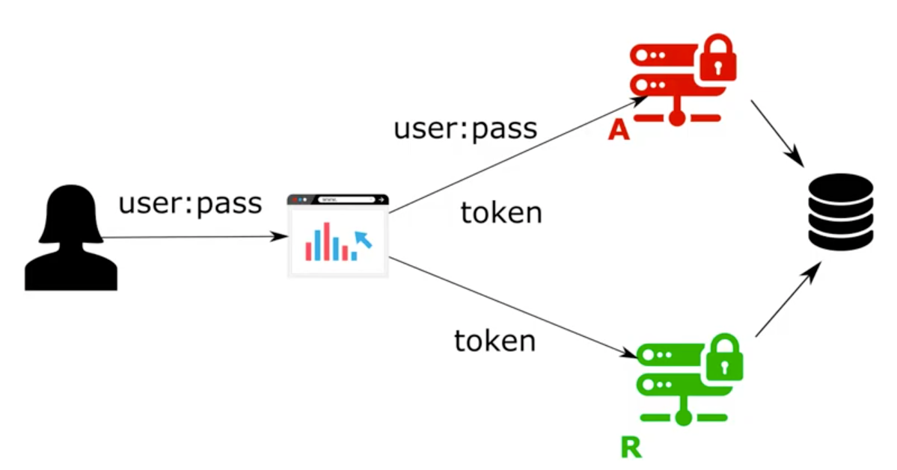

# Chapter 15

- Blackboarding: Resource server validates authentication token from authorization server using shared database
- We use a jdbc token store for blackboarding in this demo
- Use case for jdbc token store:
    - Container orchestration
        - We need to persist token in db as container do restart which will lose all the in memory accss token 

## Demo: Authorization server

### Create new project for authorization server
- Create project with dependencies
    - spring web, spring security, oauth2, mysql driver, spring data jdbc
    

### Create database tables
- for jdbc token store
    - NOTE: schema.sql has queries to create the table
    - storing access token
        - oauth_access_token
            - token_id, token, authentication_id, user_name, client_id, authenitcation, refresh_token
    - storing request token
        - oauth_refresh_token
            - token_id, token, authentication          
    
### Create Configurations
- config package
    - UserManagementConfig
        - @Configuration
        - UserDetailsService
            - @Bean
            - uds = new InMemoryUserDetailsManager()
            - add user = Users.withUsername("bill").password("12345").authorities("read").build()
            - uds.createUser(user)
            - return uds
        - PasswordEncoder
            - @Bean returning NoOpPasswordEncoder.getInstance()
        - extend WebSecurityConfigurerAdapter
            - override authenticationManageBean
            - @Bean
    - AuthServerConfig
        - @Configuration
        - @EnableAuthorizationServer
        - extends AuthorizationServerConfigurerAdapter
        - override configure(clients)
            - clients.inMemory().withclient("client").secret("12345").scopes("read").authorizedGrantTypes("password", "refresh_token")
        - override configure(endpoints)
            - @Autowire authenticationManager
            - endpoints.authenticationManager(authenticaionManager)
        - setup tokenStore
            - @Bean tokenStore
            - Configure dataasource 
                - NOTE: just creating default tables will make jdbc token store work
                - Datasource details in application.properties
                    - spring.datasource.url=jdbc:mysql:localhost//spring_security_15
                    - spring.datasource.username=root
                    - spring.datasource.password=rishighai
                - @Autowire datasource
            - return new JdbcTokenStore(datasource)
            - In the impl of jdbc token store, you can view the tables and columns to be created in database
            - Add endpoints.tokenStore(tokenStore()) in confifure(endpoints)
 
### Test the application via postman client
- Run the application
- POST http://localhost:8080/oauth/token?grant_type=password&username=bill&password=12345&scope=read
- Basic auth
    - client | 12345
- You can view the opaque access and refresh token
- You can view an entry in oauth access token table and refresh token

## Resource server implementation (different project)

- Make token store a shared database with the authorization server
- NOTE: Anti Pattern in service oriented architecture
- called blackboarding as auth and resource server write data on the same black board

### Create project with dependenies
- spring web, spring security, oauth, mysql, spring jdbc, oauth2 resource server

### Get datasource values from application.properties from auth server
- add server.port=9090

### Add a test endpoint
- controller package
- Hello Controller
    - @RestController
    - @GetMapping ("/hello") returning "Hellp!"
    
### Add coniguration
- package config
- ResourceServerConfig
    - @Configuration
    - @EnableResourceServer
    - extends ResourceServerConfigurerAdapter
    - @Autowire datasource
    - Configure token store => pick up the bean from authorization server
    - override configure(resources)
        - resource.tokenStore(tokenStore())
    
### Test the application
- Run the application
- http://localhost:9090/hello
    - Authorization | Bearer <access-token> from database
    - You can view Hello!
- Worked without introspection endpoint as we have a shared database between resource server and authorization server
- Prefered approach:
    - Store token in database
    - Validate token via token introspection