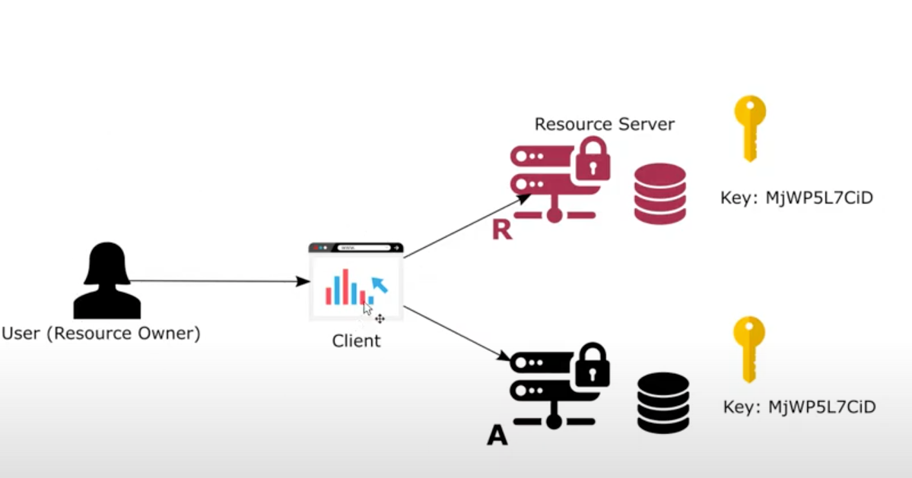

# Chapter 16

#### Using non-opaque tokens in Spring Security using JWT

- We will also be storing client details in the database

## Demo

### Create a new project with dependencies
- spring web, spring security, spring security oauth2 (soon to be deprecated), spring data jpa, mysql driver

### Configuration UserManagementConfig
- Package config
- UserManagementConfig
    - @Configuration
    - extends WebSecurityConfigurerAdapter
    - override authentication manager bean with @Bean
    - Add users: Create UserDetailsService bean
        - inMemoryUserDetailsManager = new InMemoryUserDetailsManager()
        - userDetails = User.withUsername("john").password("12345").authorities("read").build()
        - inMemoryUserDetailsManager.createUser(userDetails)
        - return inMemoryUserDetailsManager
    - Create PasswordEncoder @Bean
        - return NoOpPasswordEncoder.getInstance()

### Configuration AuthServerConfig
- in config package
- AuthServerConfig with @Configuration and @EnableAuthorizerServer
- extends AuthorizationServerConfigurerAdapter
- create clients
    - override configure(clients)
    - clients.withClientDetails() // we need to create a ClientDetailsService
- create configure(endpoints)
    - Autowired AuthenticationManager
    - endpoints.authenticationManager(authenticationManager)

### Create database table for clients
- create and use database ss_chapter16
- create table client
- Add columns
    - id PK | NN  | AI
    - client_id varchar
    - secret text
    - grant_type
    - scope
- Add client
    - 1 | client1 | secret1 | password | read

### Setup datasource
- Create application.properties in resources folder
- Add
    - spring.datasource.url=jdbc:mysql://localhost/ss_chapter16
    - spring.datasource.username=root
    - spring.datasource.password=rishighai

### Implement ClientDetailService
- create security package
- Create class JpaClientDetailsService
- implements ClientDetailsService
- override loadClientByClientId(String s)
- Create bean returning new ClientDetailsService() with name as cds() to avoid clash with default clientDetailsService
- Autowire the bean in authServerConfig and add it to configure.withClientDetails()

### Create Client entity
- package entities
- Client class with @Entity
- int id
    - @Id, @GeneratedValue(strategy = GenerationType.IDENTITY)
- String clientId
    - @Column(name="client_id")
- String secret
- String grantType
    - @Column(name="grant_type")
- String scope
- Add getters and setters
- client.clientId()
- isSecretRequired()=>true
- client.getSecret()
- isScoped()=>true, getScope => Set.of(client.getScope())
- getAuthorizedGrantTypes() => Set.of(client.getGrantType())
- getAuthorities()
- NOTE: redirectUri needed for auth code grant type and are usually stored in database
- getAuthorities() => List.of(()->client.getScope())
- NOTE: implement both getScope() and getAuthorities()
- NOTE: validity seconds (access/refresh token) take default value if not implemented

### Create Client decorator over ClientDetails
- security package
- SecurityClient
- implements clientDetails
- override all the methods
- add field Client client with all args constructor

### Client repository
- package repositories
- Interface ClientRepository extends JpaRepository<Client, Integer>
- Optional<Client> findClientByClientId(String clientId)

### Configure JpaClientDetailsService in ClientDetailsService
- @Autowired CLientRespository
- In loadClientByClientId()
    - clientRepository.findClientByClientId(clientId).map(c->new SecurityClient(c)).orElseThrow(()->new ClientRegistrationException(":(")))

### Test authorization server with opaque token via postman client
- get access token
    - http://localhost:8080/oauth/token?grant_type=password&username=john&password=12345&scope=read
    - Add client basic auth
        - client1 | secret1

### Creating JWT token store
- In AuthServerConfig
- Add JwtAccessToenConverter @Bean
    - It configures the token store (configure keys on token)
    - convertor = new JwtAccessTokenConvertor()
    - convertor.setSigningKey("secret")
        - Generally a series of bytes
        - It is private
        - Used by auth server to sign a token
- Add TokenStore @Bean
    - return JwtTokenStore(convertor())
- Configure token store and convertor
- In configure(endpoints)
    - endpoints.tokenStore(tokenStore()).accessTokenConvertor(convertor())
    
### Test the application
- Restart the application
- get access token
    - http://localhost:8080/oauth/token?grant_type=password&username=john&password=12345&scope=read
    - Add client basic auth
        - client1 | secret1
- We have the JWT access token (probably the only non opaque implementation)
    - <b>JWT: JSON web token</b>
    - It is an encoded String version

### Decoding JWT
- go to jwt.io and paste ypur encoded token
- decoded
- JWT is base 64 encoded to make them shorter to send over network
- Has 3 parts separated by "."
    - Red: Header
        - has algorithm, type of token, key(if used)
    - Purple: body
        - This is non opaque token as we can see through the token
        - JTI is a uuid
        - has username | authorities
        - has clientid | scope
    - Blue: signature (optional but usually always there)
        - Signing the token ensures that no one is able to change the token
        - If we change the token, the signature of the token changes
- 
- Synchronous/Symmetric key
    - Golden key refers to private key
    - One with private key can sign the document
    - Auth server uses a cryptographic algo to sign token with the key
    - the key is symmetric by default
    - the resource server will have to use the same key to validate the sign
    - Avoids man in the middle attack
    - Disadvantage
        - Key has to be shared between authorization and resource server