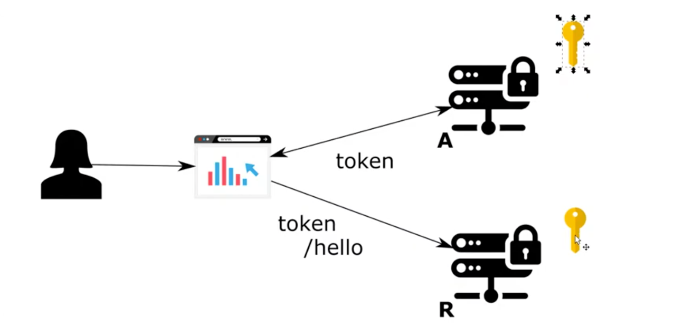
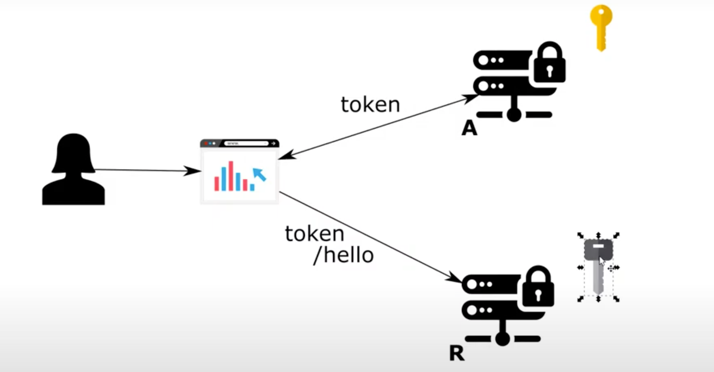

# Chapter 17

#### Using symmetric/synchronous keys with JWT (password/authorization grant type)

- <b>Benefit of using a database for storing clients. You can use any grant type for any client</b>
- JWT is non opaque
    - It has all the info about user and client
    - Resource server does not need to do blackboarding with auth server (share database) or do introspection on auth
      server

## Demo: Authorization code grant type implementation

- Get the codebase from previous chapter to work on to chapter 17 (authorization server)

### Test the existing password grant type implementation

- Call token endpoint
    - http://localhost:8080/oauth/token?grant_type=password&username=john&password=12345&scope=read
    - Basic auth for client
        - client1 | secret1
- You receive the JWT token
    - A base64 encoded string of the JSON

### Add a new client in database table with auth_code grant type

- 2 | client2 | secret2 | authorization_code | read

### Add redirect URI in SecurityClient (ClientDetails contract) object

- Needed for auth code grant type to call back the client
- getRegisteredRedirectUri()
    - return Set.of("http://localhost:9090")

### Add form login

- Done by default by spring boot if auth code grant type exists for a client

### Test the authorization code grant type

- Rerun the application
- Get auth code via browser
    - http://localhost:8080/oauth/authorize?response_type=code&client_id=client2&scope=read
    - User Redirected to form login by auth server
    - john | 12345 => authorize the request
    - you get the code on redirect uri
        - has to be an accessible endpoint at the user side
    - auth code can only be used once
- Call auth server with auth code to get the access token
    - http://localhost:8080/oauth/token?grant_type=authorization_code&code=<code>&scope=read
    - Client basic auth: client2 | secret2
- you get back the access token
- try re running the endpoint. It fails as authorization code can be used only once

## Demo for creating the resource server

### Create new project with dependencies

- spring web, spring security, oauth2

### Create configuration

- config package
- ResourceServerConfig
    - @Configuration @EnableResourceServer (Secures all the endpoints with a token needed for authorization)
    - <b>NOTE: if you do @EnableAuthorizationServer, it will disable authentication as there is no auth around
      controller in auth server. We use auth server just to expose the token endpoints./b>
    - NOTE: extends ResourceServerConfigurerAdapter and overriding configure not necessary for implementing resource
      server with token store
    - Create @Bean for convertor()
        - conv = new JwtAccessTokenConvertor()
        - <b>Symmetric signing key</b>
            - add the same signing key as authorization server
                - conv = new JwtAccessTokenConvertor()
                - conv.setSigningKey("secret")
                - return conv
                - In real world deployment, put symmetric signing key in vault and not as plain text anywhere in
                  container
    - Create @Bean for tokenStore
        - return new TokenStore(convertor())
- NOTE:
    - on running resource server(auth server) you will see the default user/client credentials logged in console
    - these credentials are generated by the default user details service
    - you can do two things
        - remove them
        - let them be as they would not affect the oauth implementation in any way

### Create endpoint

- controller package
- HelloController
    - @RestController
    - @GetMapping ("/hello")
        - return String "Hello!"

### Change the port

- resources/application.properties
    - server.port=9090

### Test the application via postman client

- Generate token via password grant type (works same with authorization grant type as we have an entry for client in
  client table in database)
- Hit hello endpoint
    - http://localhost:9090/hello
    - header
        - Authorization => Bearer <token>
    - No need of basic auth for resource server
- You get back the response from the endpoint

### Symmetric Key

- 
- Workflow
    - Client asks for the token
    - Auth server signs and sends the token
    - CLient sends request to resource server with the token
    - resource server valdiates the token and responds
    - Resource server has the symmmetric key which it can also use to generate token
- Same key used in authorization server and resource server
- The key is exposed in multiple points (auth and resource server)
- Can be used to generate token with the key which can be used to access the resource server
- Always provide the minimum privileges
    - The database should be configured by insert and delete by the DBA
- Resource server can also sign the token

## Demo Resource server and authorization server in same application (delete after testing)

- Add config
    - config=>ResourceServerConfig
    - @Configuration @EnableResourceServer
- Add controller
    - controller package
    - HelloController
        - @RestController
        - @GetMapping ("/hello")
            - return String "Hello!"
- <b>Will work as we have the same token store </b>
- Test the application
    - Generate token via password grant type
    - Hit hello endpoint
        - http://localhost:9090/hello
        - header
            - Authorzation => Bearer <token>
- Not advisable in real world scenario

## TBD in next lesson

- 
- Asymmetric key
    - Public key
    - Different for each resoruce server
    - Can just validate a token and not create one (solving the vulnerability in symmetric key)