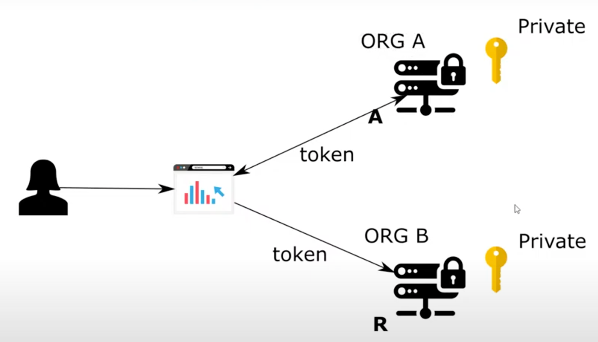
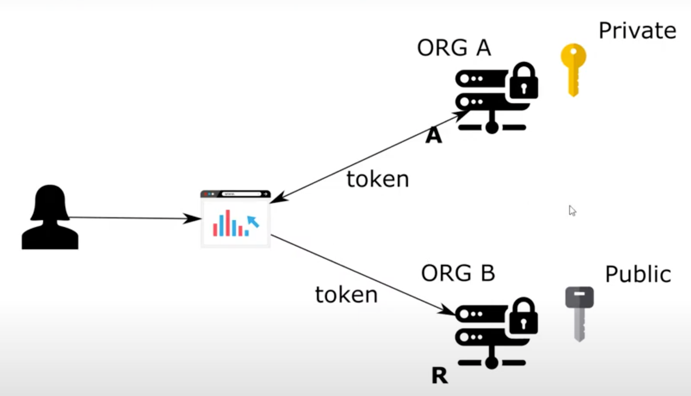
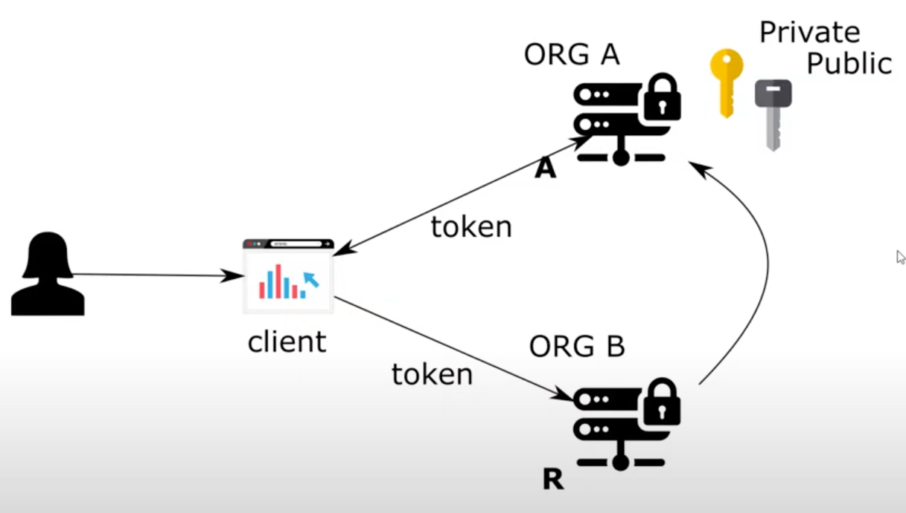

# Chapter 18

#### Using asymmetric/asynchronous key pairs with JWT (password/authorization grant type)

- 4 clients : user , client, authorization server, resource server

## Symmetric keys

- golden key
- it is owned by someone
- workflow
    - client asks for access token from authorization server
    - client gets an access token
    - the token is JWT token contains signature in the end signed by authorization server
    - the client sends access token to resource while trying to acces it
    - the resource server uses the same key to validate the signature is same or not
    - issue:
        - private key is shared between authorization server and resource server
        - doing this is not possible
            - e.g user trying to access facebook (authorization server)
            - facebook would not share the private key (secret) with other organization and vica versa for the
              organization
            - since whoever has the private key can create tokens
    - solution: assymetric keys
        - resource server should be able to validate the token by something they cannot use to create new tokes
        - resource server has less power hence they cannot use something on which they do not have privilege
        - software security principle: give esponsibility that is needed only
- NOTE: User can never directly call the authorization server

## Asymmetric keys

- private-public key are in pairs
- we generally create a private key and generate a public key from it using cryptographic algorithm

## Demo Asymmetric keys (Authorization server)

### Create a new project with dependencies

- spring web, spring security, oauth2

### Create configurations

- config package
- UserManagementConfig
    - @Configuration
    - extend WebSecurityConfigurerAdapter
    - override and @Bean authenticationManagerBean
    - Add users: UserDetailsService
        - @Bean
        - inMemoryUserDetailsManager = new InMemoryUserDetailsManager()
        - userDetails = User.withUsername("john").password("12345").authorities("read").build()
        - inMemoryUserDetailsManager.createUser(userDetails)
        - return inMemotyUserDetailsManager
    - PasswordEncoder
        - @Bean
        - return NoOpPasswordEncoder.getInstance()
- AuthServerConfig
    - @Configuration
    - @EnableAuthorizationServer
    - extend AuthorizationServerConfigurerAdapter
    - Plug in the authentication manager
        - @Autowired AuthenticationManager
        - configure(endpoints)
            - endpoints.authenticationManager(authenticationManager)
    - Create client
        - clients.inMemory().withClient("client1").secret("secret1").scopes("read").authorizationGrantTypes("password")
    - Create token store
        - JwtAccessTokenConvertor @Bean
            - convertor()
            - conv = new JwtAccessTokenConvertor()
            - return conv
        - TokenStore @Bean
            - return new JwtTokenStore(convertor())
        - Configure token store and convertor in spring security configure(endpoints)
            - endpoints.tokenStore(tokenStore()).accessTokenConvertor(convertor())

### Generating private-public key pair

- Use keytool CLI comming with JDK and openssl available in linux bash
- Generate private-public key pair
    - <b>keytool -genkeypair -alias ssia -keyalg RSA -keypass ssia123 -keystore ssia.jks -storepass ssia123</b>
        - generate key pair
        - an alias
        - crypto graphic algo to generate key pair : RSA
        - password for cryptographic key
        - file
        - password for the file
        - We can skip the organizational and personal info
    - ssia.jks is private-public key pair
- extract public key part
    - <b>keytool -list -rfc --keystore ssia.jks | openssl x509 -inform pem -pubkey</b>
        - provide keypass: ssia123
        - copy the public key, later to be used in resource server to validate the private key
- paste key pair (ssia.jks) in resources folder
- private key: sign a token
- public key: secure the token

### specify key pair in config

- AuthServerConfig
    - convertor()
        - KeyStoreKeyFactory: Object to convfigure and store the key
            - KeyStoreKeyFactory keyFactory = new KeyStoreKeyFactory(new ClassPathResource("ssia.jks"),"ssia123"
              .toCharArray()); // not ideal to have file and password in code
        - conv.setKeyPair(keyFactory.keyPair("ssia"))

### Test the authorization server

- Run the application
- Do post on password grant type
    - http://localhost:8080/oauth/grant_type=password&username=john&password=12345&scope=read
    - Basic auth for client
        - client1 | secret1
- you get the JWT access token by using a private key from the key pair

## Demo Setup a resource server with public key

### Create new project with dependencies

- spring web, spring security, oauth2

### Controller with demo endpoint

- controller package
- HelloController
    - @RestController
    - @GetMapping("/hello") return String "Hello!"

### Create configurations

- config package
- resources => application.properties
    - server.port=9090
    - key=<public key> (paste entire key with start and end of public key comments in a single line)
- ResourceServerConfig
    - @Configuration
    - @EnableResourceServer
    - Convertor
        - @Value("key") publicKey
        - conv = new JwtAcessTokenConvertor()
        - conv.setVerifierKey(publicKey)
        - return conv
    - TokenStore
        - @Bean
        - new JwtTokenStore(convertor())
    - extend ResourceServerConfigurerAdapter plugin the token store in configure(resources).tokenStore(tokenStore())
        - <b>This step is not necessary</b>

### Test the application

- Start the resource server
- Do post on password grant type
    - http://localhost:8080/oauth/grant_type=password&username=john&password=12345&scope=read
    - Basic auth for client
        - client1 | secret1
- Hit the resource server with access token
    - http://localhost:9090/hello
    - Header
        - Authorization | Bearer <JWT access token>
- Resource server was able to validate the token using the public key
- public key is a value that cannot be used to sign a token

### Same application cannot be used for authorization server and resource server for asymmetric key implementation

- We will have 2 tokenStore beans in the context and spring security will not know which bean to sign the key and which
  bean will be the public key to verify the signature

## TBD next lesson

- In current implementation,
    - private-public key pair is generated and stored in auth server
    - pubic key is stored in resource server
- In next chapter
    - Auth server will send it's public key part to resource server via an endpoint
      -