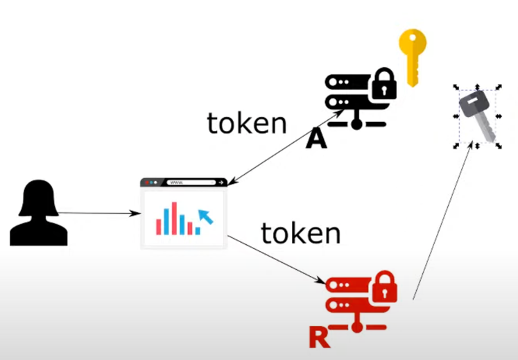

# Chapter 19

#### Configuring the authorization server to expose the public key

- Symmetric key
    - give resource server more privilege than it needs
- Asymemetric key
    - We loaded the whole kye pair in auth server
    - Auth server signs token using private key part
    - Resource server validates token using public key part
    - We copy pasted the public part in the resource server
    - Problem with approach
        - When you change the key pair on auth server, you will have to change the public key in resource server
        - There comes a need to rotate the keys as an when needed (if current key pair is compromised)
        - This makes stealing they key less probable
        - Key rotation is difficult in current setup
    - Solution
        - Expose endpoint at auth server to get the public key
    - Auth server exposed only the public key
    
## Demo : Authorization Server

### Copy paste the application from previous lesson

### Test the application
- Run the application
- We can view the various endpoints provided by authorization server
- Call check token_key endpoint
    - http://localhost:8080/oauth/token_key GET
    - You get 401 unauthorized
    - By default calls on this endpoint is denied
    - You will have to whitelist clients or permitall (like introspection token)
    
### Configure security
- AuthServerConfig
- override configure(security)
 - security.tokenKeyAccess("permiteAll()") // isAuthenticated(), permitAll()

### Test the application now
- Rerun the application
- Now calling the token_key endpoint, you get the public key

## Demo: Resource server

### Create new project with dependencies
- spring web, spring security, oauth2

### Create demo endpoint
- controller package
- HelloController
- @RestController
- @GetMapping ("/hello") returning String "Hello"

### Create resource server config
- config package
- ResourceServerConfig
- @Configration, @EnableResourceServer

### Add the auth server token_key endpoint uri
- resources => application.properties
- server.port=9090
- security.oauth2.resource.jwt.key-uri=http://localhost:8080/oauth/token_key (Automatically configures the token store)

### Test the application
- Run the resource server
- http://localhost:9090/hello
    - 401 unauthorized as we have not passed the token 
- Get access token from auth server
    - http://localhost:8080/oauth/token?grant_type=password&username=john&password=12345&scope=read POST
    - basic auth for client:
        - client1 | secret1
- Hit resource server
    - http://localhost:9090
    - Header
        - Authorization | Bearer <access-token>
    - You get the response : "Hello!"
- Resource server was able to get public key from authorization server and validate it

### NOTE
- We did not configure the public key anywhere in this application

### Update Auth server to make token access exposed to authenticated client
- AuthServerConfig
- configure(security)
    - security.tokenAccess("isAuthenticated")
    
### Test the auth server
- Calling token_key endpoint fails as the client has not provided their credentials
- Also, resource server startup would fail as it will not be able to configure the token store

### Configure the client (resource server) in Auth server
- AuthServerConfig
- configure(clients)
    - clients.and().withSecret("rs").secret("rssecret")
- NOTE: we could have used client1 but it is a bad practice for clients sharing credentials

### Test the auth server token_key with resource server crentials
- rs | rssecret works

### Make resource server client by adding the credentials
- application.properties
    - security.oauth2.client.client-id=rs
    - security.oauth2.client.client-secret=rssecret
    
### Test the resource server
- hit hello endpoint with authentication token
- returns valid response => Hello!