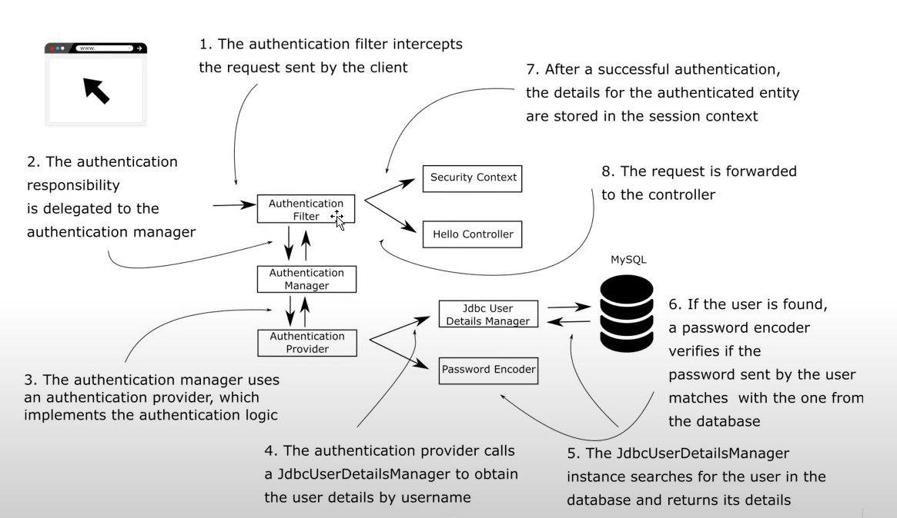

# Chapter Two

## Workflow Recap from previous chapter

### Authentication Filter
- Is actually part of a filter chain
- Filter chain has components with multiple responsibilities
- Each filter chain has a manager
- This one is responsible to authenticate a user

### Authentication Provider
- Responsible to retrieve credentials and verify password (2 separate objects)
    -  UserDetailService and PasswordEncoder
    

## Demo: Implementing our own UserDetailsService getting user from MySQL

### Creating a new project
- Dependencies Web, Spring Security, Spring data JPA, MySQL Driver

### Create a REST endpoint in a controller "/hello"
- NOTE: POST/PUT/DELETE would not work by default due to CRSF

### Configure JDBC Datasource to connect to MySQL
- App fails on startup due to JPA Auto Configuration
- Go to MySQL workbench and do some setup
    - db name: spring
    - Name of table should be same as Model: user
    - Add fields: make id auto increment, username and password fields as varchar
    - Add a user bill, 12345
    
### Note
- In a micro service architecture environment, you can authenticate a service mesh using technology like Istio

### Add data source propeties in project
- spring.datasource.url=jdbc:mysql://localhost/spring
- spring.datasource.username=root
- spring.datasource.password=

### Implementing our own UserDetailService
- Create a config class ProjectConfig
- Add a bean for PasswordEncoder doing a no op
- Add a bean for UserDetailsService
- Create a class called JPAUserDetailsService and implement UserDetailsService. NOTE: Interface can throw exception for documentation
- Return instance of type JPAUserDetailsService and return it in UserDetailsService bean

### Create repositories and entities
- Create Entity User with id(@Id, @GenerateValue->identity), username and password
- Create UserRepository interface extending JpaRespository<User, String>
    - Create Optional<User> findUserByUsername(String username)
    
### Configuring repo in JpaUserDetailsService
- Autowire fetch user by username using repository
- Get the user else throw UserNameNotFoundException

### Create SecurityUser implementing UserDetails
- Wrap User in SecurityUser class
- Add List.of(()->"read") in getAuthorities()
- Return username and password

### NOTE on UserDetailsService vs UserDetailsManager
- UserDetailsService just finds user by username
- UserDetailsManager is an implementation of UserDetailsService that manages the users as well (add/update/delete user, change password)
- InMemoryUserDetailsManager in previous chapter also implements UserDetailsManager hand hence we were able to create a user