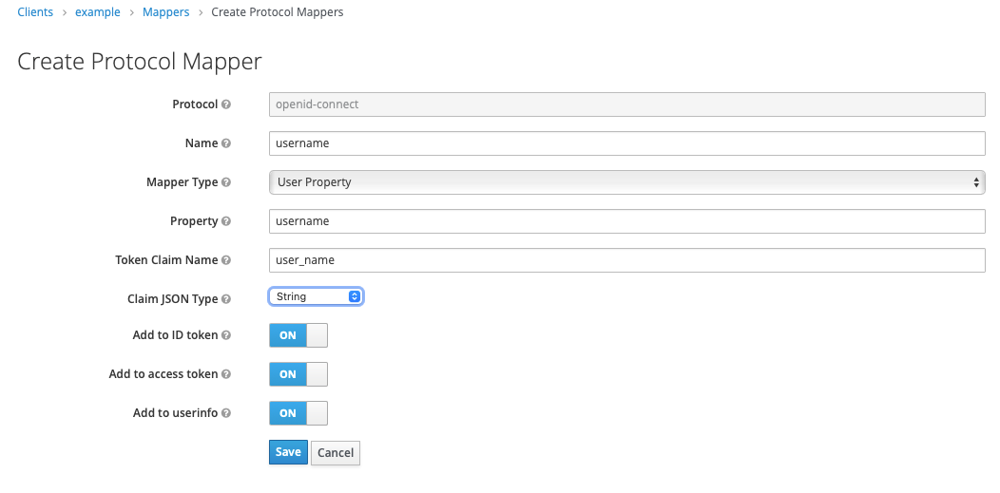
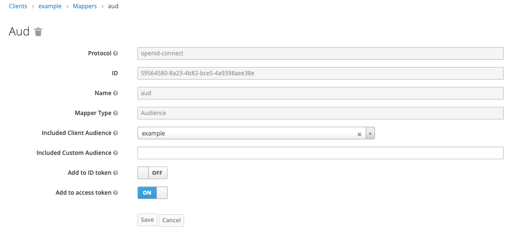
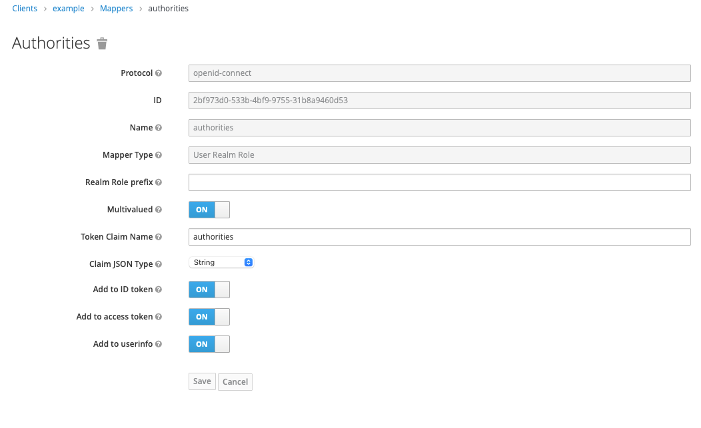

# Chapter 20

#### Using Keycloak as an authorization server

- will be using JWK token store in resource server

## Demo: Keycloak

- An Identity provider
- works as an authorization server
- Uses OpenID connect: A protocal layer above OAuth 2

### download and start keycloack application
- version > 10.0.2
- access keycloack via browser
    - localhost:8080 on browser
- Configure admin password
    - root : rishighai
- Hit open id endpoint
    - check the json response on any json formatter of your choice
    - You can view all the oauth2 endpoints
    - jwks uri exposes the public key on the authorization server
    
### Configure the token
- access token lifespan: 60 Minutes in TOken section
    - for testing. In production environment, it is fine to have around 15 minutes (depends on the application)
    - Save it

### Notes
- Direct Access Grantts enable: password/client credentials grant type
- By default, implicit grant type is disabled (Implicit Flow Enabled => OFF)

### Register clients
- Add a client
    - Configure > client
    - example and save it
- Create read scope
    - Configure => Clients
        - read
    - Add the scope to Configure => Ckuebt => Client Scopes => Only "read"
    
### Add user
- It is integrable with other system
- Manage => User
    - Add user
    - Details: john | user enable | email verified
    - Credentials: 12345
    - Add roles
        - Configure => Roles => user
        - Add in manage => users => role mappings => user
  
### Get token_endpoint from openid keycloak json response

### Test keycloak server via postman
- hit token endpoint
    - POST <token_endpoint>
    - Body (form encoded)
        - grant_type = password
        - client_id = example (we have not added a secret for the client) (no client auth needed in keycloack)
            - try using account client with its credentials => this client is recognized 
        - scope = read
        - username = john
        - password = 12345
- You can view the access token
- COPY the token and view it in jwt.io
    - Header
        - New kid field (key id)
            - identifier of the key pair
            - When token server is received by resource server, it needs to identify which keypair (from the multiple ones)
    
    

### Getting the user/audience in the jwt token
- user_name/authorities/aud are compulsory in the token for spring to recongize the token
- Configure user_name
  - 
  - 
- configure audience (client)
    - 
    - Add it to access token
- configure authorities
    - 
    - Save
- Test: regenerate the token and validate in jwt.io
    - you can view user_name, authorities, aud
    

## Implement resource server

### Create new project with dependencies
- spring web, spring security, oauth2

### Create demo endpoint
- controller package
- HelloController
- @RequestMapping
- @GetMapping("/hello") returning a String "Hello!"

### Add port
- resources => application.properties
- server.port=9090

# Check token endpoint
- get the jwks_uri on json formatter
- It has a kid 
    - It is unique for each token
    - it is same as the key id in the token
    - keycloack adds kid after sigining the token in the header
        - resource server can use this to know which public key to use. KID repsesents the private key
        - Done since keycloack can be used to configure multiple key pairs
    
### Create config
- config package
- ResourceServerConfig
- @Configuration @EnableResourceServer
- extend ResourceServerConfigurerAdapter
- Setup token store to get the public key
    - tokenStore
        - @Bean
        - Add the token endpoint in the constructor for new JwkTokenStore()
    - Configure the token store
        - override configure(resources)
        - resources.tokenStore(tokenStore())
        - A necessary step for jwk (adding audience)
            - Do resources.resourceId("example")
        
### Testing the application 
- Run the resource server
- Get the access token via keycloack
- Hit hello endpoint
    - http://localhost:9090/hello
    - Add access token
        - Authorization : Bearer <access-token>
- You get the response "Hello!"