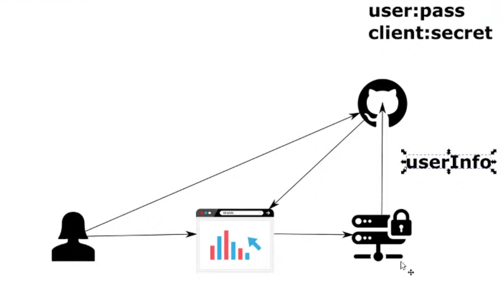

# Chapter 22

#### Implementing Single Sign On (SSO) using github as authorization server

- Using Github as an authorization server
- User tries to use the application
- User will be redirected to github (auth code), where they will be able to add github credentials
    - using username and password
    - using client and secret
    - SSO is better as we do not have to maintain the users and their credentials
- Github will redirect back to client with auth code
- Client sends auth code with client:secret to github to get back the access token
- <b>We need to register our client on github</b>

## Demo

### Create new project with dependencies
- spring web, spring  security, OAuth2 Client

### Setup client on Github
- Settings => Developer settings => OAuth Apps
- Register a new application
    - Application name: APP1
    - Homepage URL: http://localhost:8080
    - Authorization callback URL
        - Auth server calls on this redirect URI when the user logs in with authorization code
        - http://localhost:8080
    - Register application
- You can now view the client id and secret (delete the app after demo)

### Create main.html
- resources=>static
- main.html
- Title => "Bla bla" and H1 => "Welcome!"

### Create controller
- controllers package
- MainController
    - @Controller
    - @GetMapping
    - return "main.html"
    
### Implementing login configurations (DSL method for resource oauth2 client)
- config package
- ProjectConfig
    - @Configuration
    - extends WebSecurityConfigurerAdapter
    - Override configure(http)
    - http.oauth2Login()
          - Used to login with third party authorization server
          - SIDE NOTE: oauth2Client() enables you to implement a client from spring security application in OAuth2 workflow
              - Use case: Call a backend (resource server) using OAuth2 (Client credentials grant type)    
    - Write a simple authorization rule (TBD in one of the next lessons)
        - http.auhtorizeRequests()|auhtorization rules for endpointt level|.anyRequest()|All endpoints|.authenticated() |is accessible if user is authenticated|
    - Create private ClientRegistration githubClient()
        - Used to provide client details to the authorization server'\
        - CommonOauth2Provider
            - supports 4 common oauth provider (Github/google/facebook/octa)
            - CommonOauth2Provider.GITHUB.getBuilder("github").clientId("<client-id>").clientSecret("<client-secret>").build()
            - scope authorization uri, token uri, etc are set by the provider. We do not have to provide everything, just provide things spring security does not know (client-id | client-secret)
            - return the result built above
    - Create public ClientRegistrationRepository
        - Object manages client registrations
        - We can implement this via database to supply client id and client secret (//TODO try this)
        - @Bean
        - We use InMemoryClientRegistrationRespository
            - holds clients in memory
            - return new InMemoryClientRegistrationRepository(githubClient())
    - NOTE: @EnableSingleSignOn to implement SSO is deprecrated
    - Note the clientRepository takes multiple clients
        - you can have multiple logins
### Test the application
- localhost:8080
- You are redirected to github login (done by the client)
- Sign In
- Authorize
- You are redirected to main.html
- Even if we logged out of the app and login again, we are logged in as we are logged in via github
    - try http://localhost/logout and localhost:8080
    - you will get logged in
- You can view the authorization code grant type workflow in the network tab
    - App gets the authorization code
    - App sends code to github and get the access token (token cannot be viewed)
    
### Add Authentication object (Security context) in controller to view authentication object details
- controller > MainController
- main(Authentication authentication) // spring injects authentication object
- print(authentication)

### Test the application
- hit localhost:8080
- You can view the auth object
    - roles, user, role
    - we get the info via userInfo after successful authentication from authorization server(github)
    - we can store the user in database
    
### Delete github app after the demo
- Settings => developer settings => APP1 => Advanced => Delete application
    
## Todo
- Try implementing single sign on with google and facebook