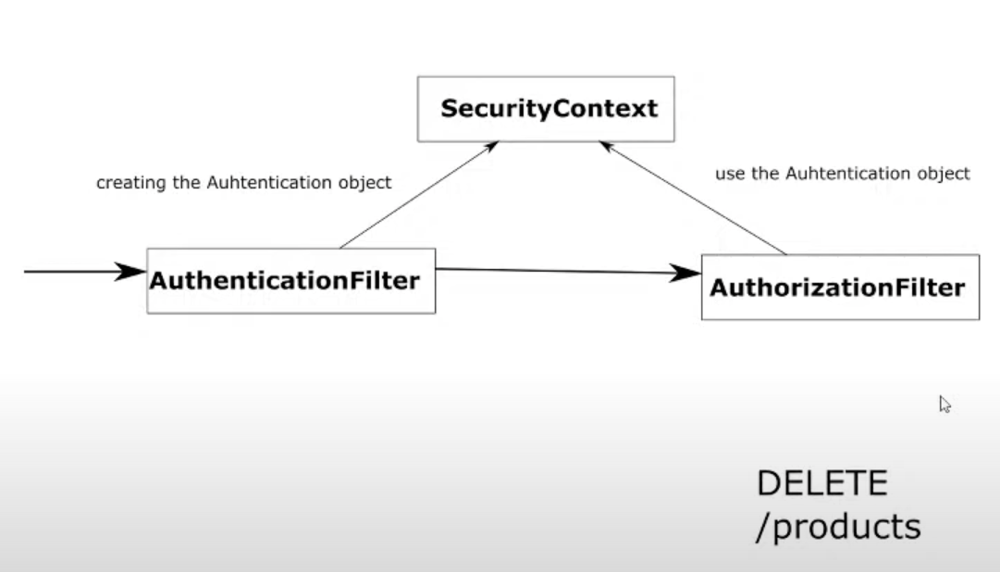

# Chapter 23

#### Configuring endpoint authorization

- 2 types of authorization configuration
    - endpoint
    - method
        - 3rd type: Inject values from queries to get data from database
- Link between authentication and authorization
    - Authentication
        - To verify request was done by someone we know
    - Authorization
        - To verify if identified caller is allowed to access a specific resource (privilege to call a specific functionality)
    - Security context
        - The place where result of successful authentication (Authentication contract) is stored
        - Authentication is stored per request
        - Authentication object is required to go ahead with authorization
        - Has the details about the user
        - Most use detail:
            - List of authorities
    - Authorization Filter
        - Authorization is done by Authorization filter
    - Use case
        - DELETE /products can be done only by user have admin access. For others should throw 403 FORBIDDEN
    
## Demo

### Create new project with dependencies
- Authentication will be done using HTTP Basic
- Dependencies: spring web and spring security

### Create controller
- controller package
- HelloController
- @RestController
- @GetMapping("/hello") returning String "Hello!"

### Create security configuration for authentication
- Create config package
- ProjectConfig
- @Configuration
- UserDetailsService
    - @Bean
    - inMemoryUserDetailsManager = new InMemoryUserDetailsManager()
    - We will be adding two users with different authorities
    - userDetails1 = User.withUsername("bill").password("12345").authorities("manager").build()
    - userDetails2 = User.withUsername("john").password("12345").authorities("admin").build()
    - // authorities are basically rules. Should not be nouns
    - Manager should not be able to call the hello endpoint
    - inMemoryUserDetailsManager.createUser(userDetails1)
    - inMemoryUserDetailsManager.createUser(userDetails2)
    - return inMemoryUserDetailsManager
- PasswordEncoder
    - @Bean
    - return NoOpPasswordEncoder.getInstance()
- Authentication is complete with default HttpBasic authentication

### Create security configuration for authorization
- config => ProjectConfig
- extend WebSecurityConfigurerAdapter
- override configure(security)
- http.httpBasic() // is the default one
- http.authorizeRequests() 
    - tells spring that the following things are about endpoint authorization configuration of the request
- Matcher Method
    - .anyRequest() // allows all request
    - tells spring which endpoints to add authorization
    - 3 types
        - ant
        - mvc
        - regex
- the rule 
    - permitAll() // allow access to the request
    - related to authorization
    - authentication will happen
    
### Test the application
- hit hello endpoint
    - http://localhost:8080/hello
- The endpoint was called even the user was not present
- Try with user
    - basic auth bill | 12345
    - We get the response
- Try wrong credentials
    - basic auth mary | 12345
    - you get 401 unauthorized
- permitAll works with no user or correct user. Does not work with wrong credentials
    - Reason:
        - Authentication Filter runs before Authorization Filter
        - If you provide authentication details then authentication filter will work and validate credentials
    
### Make rule as denyAll()
- config=>ProjectConfig=> configure(http)
- .denyAll()
    - denies all the request after authentication
    
### Test the application
- hit hello endpoint with valid user bill | 12345
- You see 403 Forbidden

### Apply authority admin via hasAuthority rule
- authorities added to user implement GrantedAuthority contract
- has single method to get the privilege
- manager and admin are custom authorities created by us
- config => ProjectConfig => configure(http)
- hasAuthority Rule
    - .hasAuthority("admin")
    
### Test the application
- Test with bill 12345
    - 403 as bill is a manager
- Test with john 12345
    - Hello! as john is an admin
- Test with noAuth
    - Remove the cached header by restarting postman request or try with curl
    - curl
        - curl http://localhost:8080/hello
        - 401 Unauthorized
    - curl bill
        - curl -u bill:12345 http://localhost:8080/hello
        - 403 as manager
    - curl john
        - curl -u john:12345 http://localhost:8080/hello
        - 200 as john is an admin
    
### Test with manager as authorized user and not admin (rollback this post demo)
- Replace admin with manager
- works for john

### Adding multiple hasAuthority rules: .hasAnyAuthority()
- hasAnyAuthority("admin", "manager")

### Test the application
- bill and john both would be able to call the hello endpoint

### Authority vs Role
- Spring security distinguishes between authorities and roles
- manager is a badge that defines a role in hasAuthority
- Spring has separate role methods for hasROle
- Role is a badge and is a noun telling who can access
    - manager should be ROLE_manager and admin should be ROLE_admin
- authority is a verb telling what action can be done by the role