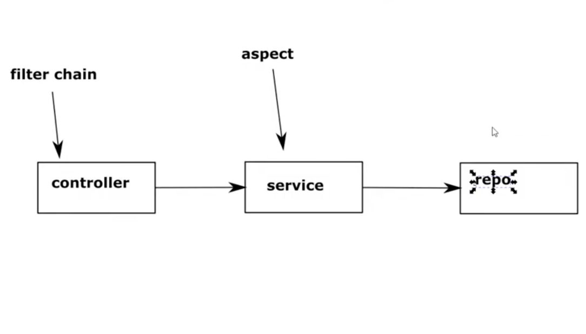

# Chapter 27

#### Method authorization configurations

- We have to enable method authorization explicitly using an annotation
- Has 6 different configurations (annotations)
    - Pre Authorize
    - Post Authorize
    - Pre Filter
    - Post Filter
    - Secured (less powerful)
    - Roles Allowed (less powerful)
    
- Workflow
    - 
    - After authentication, security context stores authentication instance
    - After that, authorization is applied by filter chain
    - Spring also used for non web apps
    - Filter chain is specific to HTTP requests
        - Authorization in this case cannot be done at end point level by filter chain
    - Thus, we need method level authorization
        - Done via aspect with provided annotations
        
## Demo

### Create new project with dependencies
- spring web, spring security

### Create service
- service package
- ProductService
- List<String> findProductsForUser(String username)
    - return List.of("beer", "chocolate")
    
### Create test controller
- controllers package
- ProductController
- @RestController
- @Autowire productService
- @GetMapping("/products/{username}") List<String> findProductsForUsername(@PathVariable username)
    - return productService.findProductsForUser(username)
    
### Create configurations
- config package
- ProjectConfig
- @Configuration
- @EnableGlobalMethodSecurity(prePostEnabled = true)
    - has 3 attributes to mention which annotations to be used
    - All are disabled by default
    - You have to explicitely enable
    - prePostEnabled has the 4 important annotations
        - @PreAuthorize
        - @PostAuthorize
        - @PreFilter
        - @PostFilter
    - secured and jsr250 provide the other two less important annotations
        - @Secured : secured
        - @RolesAllowed : jsr250
- UserDetailsService
    - @Bean
    - uds = inMemoryUserDetailsManager()
    - user1 = User.withUsername("john").password("12345").authorities("read").build()
    - user2 = User.withUsername("bill").password("12345").authorities("write").build()
    - uds.createUser(user1)
    - uds.createUser(user2)
    - return uds
- PasswordEncoder
    - @Bean
    - NoOpPasswordEncoder.getInstance()
- enable http basic for enabling authentication
    - extend WebSecurityConfigurerAdapter
    - override configure(http)
    - http.httpBasic()
- Disable endpoint level security
    - configure(http)
    - http.authorizeRequests().anyRequest().authenticated() // permitAll will throw npe on no authentication on hitting controller as auth object null
    

### Test the application via postman to demo there is no authorization
- Start the application
- Hit products endpoint
    - http://localhost:8080/products
    - 401 unauthorized as no credentials passed for authentication
- Hit product endpoint with basic auth john | 12345
    - You get the response ["beer", "chocolate"]
    
### PreAuthorize authorization
- service => ProductService
- @PreAuthorize("hasAuthority('write')")
- Test products service with john | 12345
    - 403 forbidden as john has authority read and authorization rule mentions hasAuthority(write)
- /products bill|12345
    - 200 OK as bill has write authority
    
### Add commends on service
- service => ProductService
- @PreAuthorize
    - the authorization rules are validated before calling the protected method
- @PostAuthorize
    - the methods is called, adn then the aspect validates the authorization rules
    - Does not used with methods that change things
    - Only , the response would not be returned to the end user
- @PreFilter
    - In Authorize annotation, you either get or do not get the result
    - In PreFilter, methods needs to have the parameter of type Collection or Array
    - the aspect intercepts the methods call and validates the values inside the Collection/Array
    - Method is called with n values, but aspect calls the method with only values valid from the n input values
- @PostFilter
    - returned value should be collection or array
    - aspect applies the authorization rules and returns only the values that comply with authorization rules
    
### Refer to parameter of method in PreAuthorize
- service => ProductService
- use case: We want to make sure that the username passed is same as the user that is authenticated
- @PreAuthorize("#username == authentication.name)
    - username parameter is equal to the authenticated user's name
- Test: login with bill and try to access product via john (possible vulnerability when @PreAuthorize is not configured with username validation)
    - http://localhost:8080/products/john : bill | 12345
        - you get 403 forbidden
    - http://localhost:8080/products/bill : bill | 12345
        - 200 OK
    
### A good practice while writing global method security configuration rules
- If @PreAuthorize has a more complex condition, either extract logic in a method or use permission to have custom logic

### NOTE on authorization rules
- can be applied at a controller/security/repo/etc level
- depends upon the use case