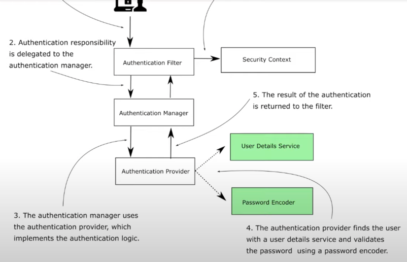

# Chapter 3

#### Configuring JdbcUserDetailsManager and BCrypt Password Encoder with an endpoint to add user to database

## Demo

### Add depenendencies
- web, spring security, mysql connector java, spring data jdbc starter

### Create a controller with get end point returning a String
- controller package -> HelloController -> Get Request

### Create config classes
- ProjectConfig
    - Declare UserDetailsService bean returning null and PasswordEncoder bean returning no op.
    
### NOTE: UserDetailsManager
- UserDetailsManager: 
    - Needed when you have to do operations other than find on users (create/update/delete)
    - Extends UserDetailsService which has single method - loadUserByUsername
    
### NOTE: JdbcUserDetailsManager
- Directly uses jdbc (no need for hibernate) as object
- Just provide the data source and this class already has all the queries for default table
- To use it we just have to create tables defined by the object nad provide a data source

### Configure JdbcUserDetailsManager
- Return JdbcUserDetailsManager in ProjectConfig class.
- You will have to inject data source 
- Create a datasource bean in the ProjectConfig class
    - Add spring-boot-starter-jdb dependency
    - Create datasource bean: Do DriverManagerDataSource and set url(jdbc:mysql://localhost/ss_chapter3), username and password and return the data source.
- Create tables in mysql
    - Create users table with columns username varchar PK, NN, password TEXT, enabled INT (Not used in this example)
    - Create authorities with id PK, NN, AI, username varchar, authority varchar
    - Add a user : john, 12345, 1. Add authority for john, read ,1 ; john, write, 2
    
### Run application and test it
- localhost:8080/hello with basic auth: john, 12345 => 200 OK

### Create a new PasswordEncoder
- Used to hash your password
- Return an instance of BCryptPasswordEncoder
- Delete record with password as plain text from users and authorities

### Create a user model
- username, password
- implement UserDetails and implement all the needed methods

### Create user via a new endpoint (/user)
- Add a PostMapping. As we are using post, spring expects a CSRF token. Disable the protection using 
- Accept user via post (@RequestMapping)
- Inject JdbcUserDetailsManager (return the same in ProjectConfig userDetailsService bean) as userDetailsManager and do a create user using createUser(User)

### Post request fails as auth is enabled 
- Post with {"username": "john", "password": "12345"}

### Fix CSRF issue by disabling it and try using addUser again
- in project config extend WebSecurityConfigurerAdapter and implement configure method
- http.httpBasic()
- http.csrf().disable()
- http.authorizeRequests().mvcMatchers("/user").permitAll().anyRequest().authenticated()
    - Allow any request at /user
    - Ideally should be done for admin role user only
- Now the request works
- user is now created in database tables

### Including password encoder
- In controller, autowire password encoder and call encode method on get password
- Now hitting the controller will include user with encoded password
- NOTE: you cannot convert hash back to plain text. For same password, hash would be different. Try it out by adding new user with same password
- Now hello endpoint would authenticate and work. Password encoder can validate plain text vs. hashed password