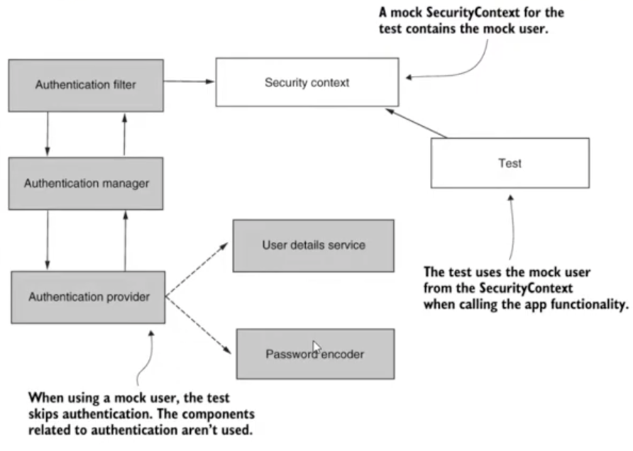

# Chapter 33

#### Integration testing for Spring Security implementations - Part 1

- Tests are necessary to handle bugs
- Also serves as documentation
- Tests to be split into authentication and authorization
- Tests generally written for authorization as it is of many types
- Authorization tests
    - would be working with only the security context in the entire workflow
    - Test creates a mock security context assuming that the user is authenticated

## Demo

### Create new project with dependencies

- spring web, spring security
- NOTE: Main class with Spring boot enabled is necessary for Spring test to run

### Create controller

- controllers package
- DemoController
- @RestController
- String demo()
    - @GetMapping("/demp")
        - return "Demo!"

### NOTE

- you have the spring boot starter and spring security test dependencies
    - in the test scope (will not be used at runtime)

### Create Example1Tests

- src => test => java => package
- Example1Tests
- @SpringBootTest
- @AutoConfigureMockMvc // includes spring context
- @Autowired MockMvc mockMvc
- NOTE:
    - <b>Always write integration test for your rest endpoint (using mockMvc works)</b>
- unauthenticated
    - @Test
    - void testUnauthenticatedDemoEndpoint()
        - never write function names long
        - function itself should tell its story
        - or you can use @DisplayName("When calling the /demo endpoint without authentication we should get 401
          UNAUTHORIZED")
        - mockMvc.perform(get("/demo"))
          .andExpect(status(),isUnauthorized()); // throw the exception
        - Run the test
            - You can view the display name
            - test passed
- authenticated
    - @Test
    - void testAuthenticatedDemoENdpoint()
        - mocvMvc.perform(get("/demo"))
          .andExpect(status().isOk())
    - Run the test
        - failed. 401 instead of 200
    - Create a mockSecurity context
        - creates a mock authenticated user directly without following the authentication workflow
        - @WithMockUser(username="Mary")
        - Now run the test
            - Passed 200 OK
            - Passed as Authenticated user Mary was created in the Spring context

### Create real user for running the test case

- config package
- ProjectConfig
- UserDetailsService
    - @Bean
    - uds = new InMemoryUserDetailsManager()
    - user1 = User.withUsername("john").password("12345").authorities("read").build()
    - user2 = User.withUsername("bill").password("12345").authorities("write").build()
    - uds.createUser(user1)
    - uds.createUser(user2)
    - return uds
- PasswordEncoder
    - @Bean
    - NoOpPasswordEncoder.getInstance()

### Example1Test

- authenticatedDemoEndpoint()
    - Still works and uses mary

### Add Authorization

- ProjectConfig
- extend WebSecurityConfigurerAdapter
- http.authorizeRequests().anyRequest().hasAuthority("read");

### Example1Test (endpoint authorization: Using MockUser)

- authenticatedDemoEndpoint()
    - test fails because user mary does not have authority mary
- authenticatedDemoEndpoint() => testAuthenticatedWithoutProperAuthDemoEndpoint()
    - status().isForbidden()
    - Test passes now
- testAuthenticatedWithProperAuthDemoEndpoint()
    - @Test
    - @WithMockUser(username = "mary", authorities = "read") // by default there is no authority for mock user
    - no need to provide username as authorization rule is done on authorities and not the username
    - mockMvc.perform(get("/demo")).andExpect(status.isOk())
    - Running this test will pass

### Example2Test (endpoint authorization: Using userDetailsService for testing)

- Example2Tests
- Copy all tests from Example1Tests
- testAuthenticatedWithoutProperAuthDemoEndpoint()
    - @WithMockUser => @WithUserDetails("bill") // picks user from actual user detail service bean from ProjectConfig
- testAuthenticatedWithProperAuthDemoEndpoint()
    - @WithMockUser => @WithUserDetails("john") // picks user from actual user detail service bean from ProjectConfig
- tests work same and pass as john has read and bill does not have read authority
- Ideally you should create seperate test user details service and not reuse the project config while testing
- You can use internal database.
- Do not external database/endpoint as network unreliability can fail the integration tests
- @WIthUserDetails("mary") would not work as userDetailsService bean does not have mary

