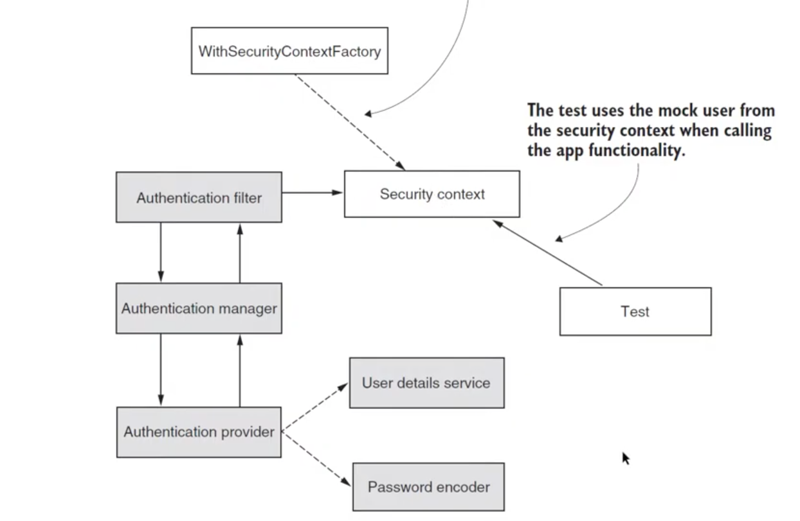

# Chapter 34

#### Integration testing for Spring Security implementations - Part 2

- you can have authentication information as a fingerprint hash instead of username and password
- In such cases you cannot user @WithMockUser
- You have to create your own implementation of security context using WithSecurityContextFactory

## Demo (Copy code from chapter_33 and delete Example2Tests)

### Replace @WithMockUser with custom annotation to define users in security context
- security package in tests
- Create your annotation
- WithCustomUser
- @interface WithCustomUser 
    - Target
        - makes it an annotation. Can be used on targets => methods, fields, parameters, classes
        - make sure that you specify the target => best practice
        - We use target method
        - <b>@Target(ElementType.METHOD)</b>
    - Retention policy
        - Annotation can be used at 3 levels
        - source code (default), byte code, runtime
        - by default spring cannot use the annotation at runtime
        - You need to specify retention policy
        - <b>@Retention(RetentionPolicy.RUNTIME)</b>
    - @WithSecurityContext(factory=WithCustomSecurityContextFactory.class) // link annotation with custom security context implementation in following step
- Add @WithCustomUser in Example1Tests => test methods
- Will not work yet as we need to link security context to the annotation
- Link annotation and security context
    - security package
    - WithCustomSecurityContextFactory implments WithSecurityContextFactory<WithCustomUser>
    - NOTE:
        - Factory design pattern: Object of one type creates object of another type
    - override factory method to create context
        - createSecurityContext(withCustomUser)
        - SecurityContext context = SecurityContextHolder.createEmptyContext()
        - Adding authentication to security context
            - you should create your own custom authentication contract implementation
            - Authentication a = new UserNamePasswordAuthenticationToken("bill", null, List(()->"write"))
            - context.setAuthentication(a)
        - return context
- Flow
    - spring intercepts annotation
    - from annotation, it gets the factory
    - from factory, it gets the security context
    
- Run the forbidden test
    - test passes as in code we have authority read
- Implement success test
    - @Test
    - @WithCustomUser
    - testAuthenticatedWIthAProperAuthDemoEndpoint
    - mockMvc.perform(get("/demo"))
        .andExpect(status().isOk())
    - WithCustomUser
        - Add logic in annotation
        - String authority()
    - Example1Tests
        - @WithCustomUser(authority="write") (without proper auth)
        - @WithCustomUser(authority="read") (with proper auth)
    - WithCustomSecurityContextFactory
        - ()->withCustomUser.authority()
    - Test all the tests
        - All are passing
    

### Testing Global Method Security
- Create Service
    - services package
    - NameService
    - @Service
    - String getName()
        - @PreAuthorize("hasAuthority('read')")
        - return "Mary"
- Create HelloController
    - controllers package
    - HelloController
    - @RestController
    - @Autowired nameService
    - String hello()
    - @GetMapping("/hello")
    - return "Hello, ".concat(nameService.getName())
- Update authorization rules for hello
    - ProjectConfig => configure
    - @EnableGlobalMethodSecurity(prePostEnabled = true)
    - .mvcMatches("/demo").hasAuthority("read").anyRequest().permitAll()
    - /hello has no endpoint authorization as we have applied method security for /hello endpoint
    - only authenticated users with authority read can call /hello
- Testing 
    - Copy Example1Tests to Example2Tests
    - Remove @MockMvc
    - @Autowired nameService
    - testUnauthenticatedGetName
        - String name = nameService.getName()
            - Running this method with throw an exception as we have not added authenticated user
            - Authentication issue: No user set
        - assertThrows(AuthenticationCredentialsNotFoundException.class , () -> nameService.getName())
            - now test passes
    - testAuthenticatedGetNameWithoutAProperAuth
        - @WithMockUser(authorities="write")
        - String name = nameService.getName()
            - throws AccessDeniedException
            - Authorization problem : User does not have correct authority
        - assertThrows(AccessDeniedException.class , () -> nameService.getName())
            - Test now passes
    - testAuthenticatedGetNameWithAProperAuth
        - @WithMockUser(authorities="read")
        - String name = nameService.getName()
        - assertEquals("Mary", name);
        - All tests now pass
    
### Testing authentication
- requires less tests as there are limited number of authentications for an application
- create Example3Tests with single method from Example2
- @AutoConfigureMockMvc
- @Autowired mockMvc
- We need to use authenticated users in user details service
- Test goes through entire authentication workflow now
- testAuthenticatedWithoutProperAuthDemoEndpoint()
    - mockMvc.perform(
        get("/demo").with(httpBasic("bill", "12345"))
      ).andExpect(status().isForbidden())
    - success
- testAuthenticatedWithProperAuthDemoEndpoint()
    - mockMvc.perform(
      get("/demo").with(httpBasic("john", "12345"))
      ).andExpect(status().isOk())
    - success
- We can test jwt() instead of httpBasic()
    - jwt takes care of creating security context and the authentication behind
- We can test opaqueToken() as well
