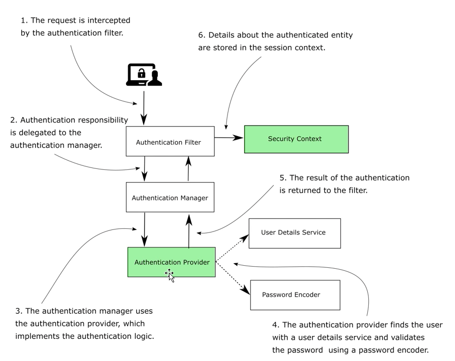

# Chapter 4

####  Implementing our Custom Authentication Provider that does UsernamePasswordAuthentication provided by HttpBasic Authentication Filter

- Authentication Provider:
    - Decides how  a user is authenticated
    - Responsible to verify username and password using User Detail Service and Password Encoder
    - To have multiple authentication provider you need multiple authentication filters

## Demo

### Create new project with dependencies
- web and security

### Create a controller with get mapping endpoint ("/hello")

### Create a customer user in memory
- Create configuration class ProjectConfig
- Create bean for UserDetailsService
    - Create a new InMemoryUserDetailsManager
    - add a "User" with | username "john" | password "12345" | authorities read |
    - create user using createUser method 
    - return UserDetailsService object
- Create a Password Encoder bean returning NoOp

### Create custom Authentication Provider
- Create package called security
- Create class called CustomAuthenticationProvider and implement AuthenticationProvider as a Component
- Responsible for checking user and validating their password
- Override 2 method: authenticate and supports
- authenticate(authentication)
    - Implement the authentication logic over here
    - Authentication object is basically token used for authentication as well as store the resultant authenticated information in Security Context
    - By design authenticate has 3 scenarios
        - 1: if the request is authentication you should return here a fully authenticated Authentication instance (isAuthenticated is true)
        - 2: if the request is not authenticated you should throw AuthenticationException
        - 3: if the authentication is not supported by authentication provider then return null
- supported(Class<?> authType)
    - method called before authenticate method accepting type of authentication
    - decides if authentication provider knows or does not know how to authenticate the password
    - EG (BasicAuth): UsernamePasswordAuthenticationToken.class.equals(authType)
- Authentication class
    - has a methods called isAuthenticated.
          - If false that means we have not decided if request is authenticated
          - Once the process of auuth is finished, this flag can be set to true
            - getCredentials
                - returns object as it can be a key/token/etc
    - getDetails: will discuss during oauth
    - also extends Principal from jdk. Principal implements getName (userName). It extends because it makes it easier to have a contract which is particular,
    - NOTE: After authentication remember flushing out the credentials from memory
- We might need to create our own Authentication class.
- HTTPBasic uses UserName Password Authentication, so we use it as Authentication type
- Flow: AuthenticationManager has a collection of AuthenticationProvider -> It calls supports on each of them and for whichever one true is returned, it uses for authentication
- NOTE: It may happen that authenticate accepts Authentication type for which it cannot authenticate then it returns null. Authentication Manager will try to find another Authentication provider
- NOTE: Authentication type is the key checked via supports method
- Implementation:
    - Autowire UserDetailsService
    - Autowire Password Encoder
    - Get username with authentication.getName() and password via authentication.getCredentials as a String
    - do userDetailsService.loadUserByUserName to get the user details. Throws AuthenticationException if user not found
    - User will not be null if UserDetailsService is created correctly. Throw BadCredentialException if user is null
    - if user is not null and passwordEncoder.matches(password, userDetails.getPassword()) return a class implementing Authentication
        - We use UsernamePasswordAuthenticationToken which accepts username, password and authroities (userDetails.getAuthorities) with isAuthenticated as true (automatically done in constructor)
- Plug the AuthenticationProvider to ProjectConfig
    - extend WebSecurityConfigurerAdapter and implement configure with AuthenticationManagerBuilder
    - Autowire Custom Authentication Provider and pass it to authenticationManagerBuilder.authenticationProvider(customAuthenticationProvider)
    - We can call authenticationManagerBuilder.authenticationProvider() multiple times to register multiple authenticationProvider
    
### Run the example
- Add a debug point to ensure AuthenticationProvider is registered correctly
- Hit hello endpoint with basic auth
- With incorrect credential authenticate should fail with AuthenticationException
- With correct credential it should return true