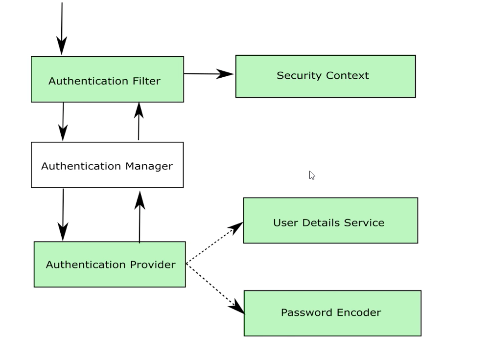
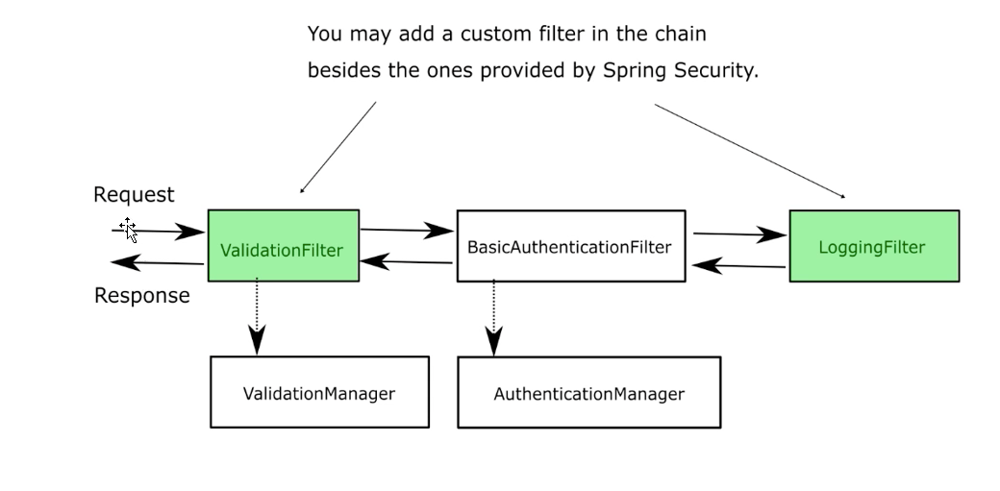

# Chapter 5

## Filter Chain

    

- Authentication Filter modifies the Authentication object
- We can add our own Authentication Filter in place of basic Authentication Filter
- We will implement something other than HttpBasic

## Demo: use case 1 Filter to authorizing the request matching the key

### Create new project with required dependencies
- spring web, security

### Create a rest endpoint with get mapping ("/hello") returning a String

### Creating our authentication filter
- Define password as a key in properties file as key: abcde
- Create a package called security with sub packages filters and providers
- Create a package called config with class Project Config
- Create filter and manager
    - Class: CustomAuthenticationFilter
    - implement Filter provided by javax.servlet can be used. 
        - It has a doFilter which accepts request, response and a filter chain to delegate work to next filter
        - Downside: We have to case ServletRequest to HttpServletRequest 
    - Implement doFilter. Rename fields as request, response, chain
    - Obtain Authorization header by first casting request to HttpServletRequest and then doing getHeader("Authorization") on the http object
    - Make Filter a componenent and autowire AuthenticationManager
    - Put AuthenticationManager bean in ProjectConfig by extending WebSecurityConfigurerAdapter and overriding authenticationManagerBean method and leaving it as is and make it a bean
    - Getting Authentication object. Ideally we should have our own impl. But we use UsernamePasswordAuthenticationToken
        - Create package called authentication in security package. Create a class called CustomAuthentication and extend UsernamPasswordAuthenticationToken and do a AllArgsConstructor
    - Create new object using CustomAuthentication class by passing authorization String for principal and null for credentials
    - Pass authentication to manager,authenticate and store it in Authentication object as result
    - Check if result is authenticated. 
        - Do SecurityContextHolder.getContext().setAuthentication(result) to set the context
        - Delegate to next filter in chain doing chain.doFilter(request, response) after doing the authorization logic
- Create provider: CustomAuthenticationProvider
    - Make it a component
    - implement AuthenticationProvider
    - Override authenticate and supports
    - In supports do CustomAuthentication.class.equals(authType)
    - Get value of the key from property
    - In authenticate get requestKey by authentication.getName()
    - If requestKey.equals(key)
        - Create new object for CustomAuthentication(null, null, null). (It automatically sets isAuthenticated) and return it
    - Else throw BadCredentialsException

- Configure filter and provider
    - In ProjectConfig autowire CustomAuthenticationFilter and CustomAuthenticationProvider
    - Override configure method with authManagerBuilder and http
    - Provider
        - In authManager configure do auth.authenticationProvider(provider) to set the provider in the manager
    -Filter
        - Add CustomAuthenticationFilter in exact location as BasicAuthenticationFilter. Hence we have possibility of add filter at particular position
        - Add filter in filter chain http configure do http.addFilterAt(filter, BasicAuthenticationFilter.class)
        - do http.authorizeRequests().anyRequests().permitAll()
    
### Test the application
- Do http://localhost/hello
- GO to headers and add Authroization as abcde. You get response 200
- Try value other than abcde. You get 500 because filter has not returned 403

### Writing 403 in filter
- Put filter part where manager authenticates request in try catch.
- Get httpResponse by casting servlet response.
- Do httpResponse.ssetStatus(HttpServletResponse.SC_FORBIDDEN) in else and catch block
- Now wrong header value returns 403

### Alternative to Filter
- OncePerRequestFilter. Called only once in Filter chain. 
- It already implements foFilter. We have do implement doFilterInternal
- Converts ServletRequest to HttpServletResponse in request body