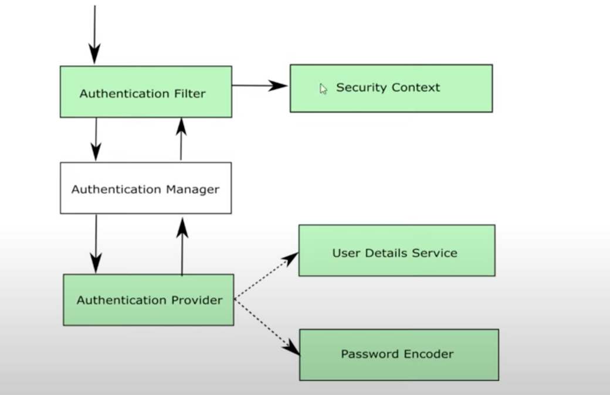

# Chapter 7

#### Multiple Authentication Providers Part 2
#### Security Context
#### NOTE: Demo continued from previous chapter

- Add second part of authentication using uuid by adding another filter

## Demo

          

### TokenAuthentication
- In authentication package
- extend UsernamePasswordAuthenticationToken
- Add both constructors

### Create a new filter for Token authentication
- Create TokenAuthFilter in filter package
    - @Component
    - Implement OncePerRequestFilter
    - Override doFilterInternal and shouldNotFilter
    - shouldNotFilter
        - request.getServletPath().equals("/login") -> Works for all endpoints other than login
    - doFilterInternal
        - Get token from request.getHeader("Authorization")
        - Create package called managers in security package
        - Create TokenManager class
            - @Component
            - Create a Set<String> tokens to store tokens in memory
            - Create add(String token) to add a token
            - Create a boolean contains(token) returning true if token is present
        - Autowire token manager
        - Autowire authentication manager and do authenticationManager.authenticate()
- Create TokenAuthentication object
- add object to authenticationManager.authenticate(tokenAuthentication)
- if is authenticated
    - Do SecurityContextHolder.getContext().setAuthentication(result of authenticate)
    - filterchain.doFilter(request, response)
- else set response status as forbidden 403

### TokenAuthProvider
- @Component
- Create class in providers package
- Implement Authentication Provider and imlement authenticate and supports
- supports
    - TokenAuthentication.class.equals(authType)
- authenticate
    - Autowire TokenManager
    - Get token by String.valueOf(authentication.getName())
    - Do exists = tokenManager.contains(token)

        - exists = tokenManager.contains(token) (Ideally should be decoupled in an authentication provider)
        - if (exists) 
            - filterchain.doFilter(request, response)
        - else throw new BadCredentialsException
    - UsernamePasswordAuthFIlter
        - Autowire tokenManager and do tokenManager.add(token) in step 2
        - if (exists) return new TokenAuthentication(token, null, null)
        - else throw BadCredentialsException
        
### Configure token autjentication
- Autowire TokenAutnenticationFIlter and TokenAuthProvider
- Add filter by doing addFilterAfter(tokenAUthFIlter, BasicAuthenticationFilter.class)
- Add provider
- SecurityContext is the border between authentication and authorization

### Test entire workflow
-  