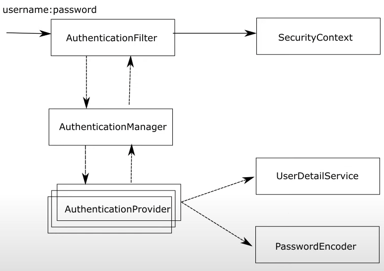

#Chapter 1

## Spring Security Architecture:

### Authentication Filter:
- Intercepts HTTP Request on server side
- Forwards request to auth manager object
- Default Implementation: Basic Authentication Filter

### Authentication Manager:
- Decides which provider will handle the authentication request

### Authentication provider:
- Spring security allows you to register multiple authentication providers.
- Authentication provider tells spring how to authenticate the user.

### UserDetailService:
- Contract that allows Authentication provider to know user’s username, password, roles
- We have to let spring now how to read the username and password for authentication
- Retrieves details from DB/memory/LDAP

### Password Encoder:
- Authentication provider uses this to know if password is correct and role is valid
- E.G B Crypt
- Password always hashed and kept in key-store
- Has methods encode and matches for verifying password

### Security Context:
- If user is valid, the details are stored by authentication filter in Security Context object.
- Stores users authorities. i.e what the user is allowed to do

## Demo:

- Create a rest endpoint that return String
- Adding spring security auto configures some default security. You have to override this configuration (dummy implementation that tells spring security is working)
- Dummy Implementation: Username is “user” and password is printed in console. Only useful to ensure that spring security is working,
- Hitting the endpoint giver unauthorised as you have not sent a username and password.
    - Select basic auth on postman and try hitting the endpoint with username and password - Result: 200 OK
    - POSTMAN base 64 encodes username and password in HTTP header
        - Base 64 encoding:
            - Base 64 makes it easier to send data over network to the server
            - It does not protect the username and password
            - This header can be intercepted and decoded
            - Encoding used for dev purpose.
- Overriding UserDetailService and Password Encoder:
    - Create a Config Class ( say ProjectConfig)
    - Expose bean for UserDetailsService
        - Expected to provide username/password/etc and return the contract UserDetails. If not found, throw UserNameNotFoundException
        - Has methods like is Credentials Expired etc
        - Use InMemoryUserDetailsManager for this demo
        - Provide user Using User.Builder to provide in memory user:
            - User: bill
            - Password: 12345
            - Authority: read
        - Create user via UserDetailsService and User
- Now our system has a user named Bill
- Now auto generated password would not appear.
- App will fail as we did not override password encoder : No password encoder found (by Authentication Provider)
- Defining password encoder
    - reate bean of type PasswordEncoder
    - Return encoder to return password as is (because we have stored password as plain text in user details service): NoOpPasswordEncoder
- Now we get a 200 Response
